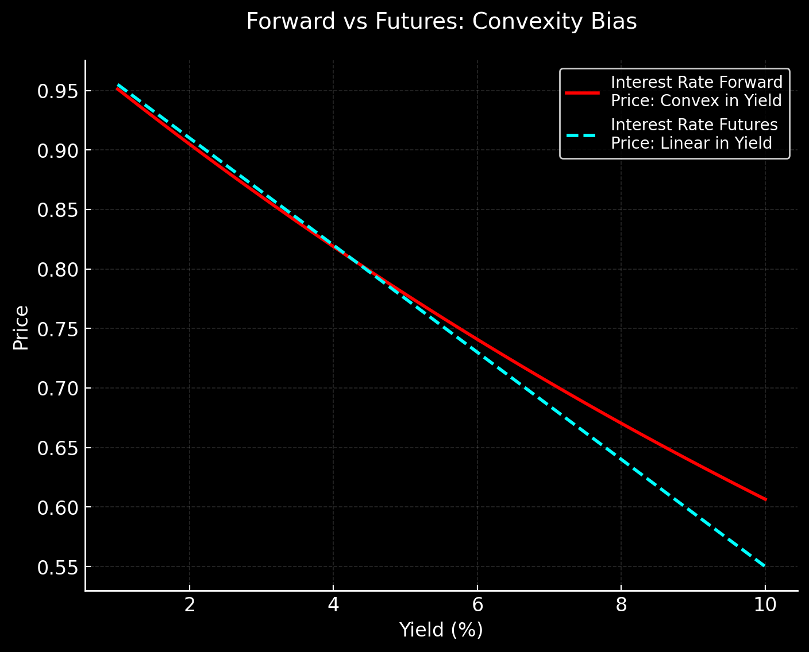
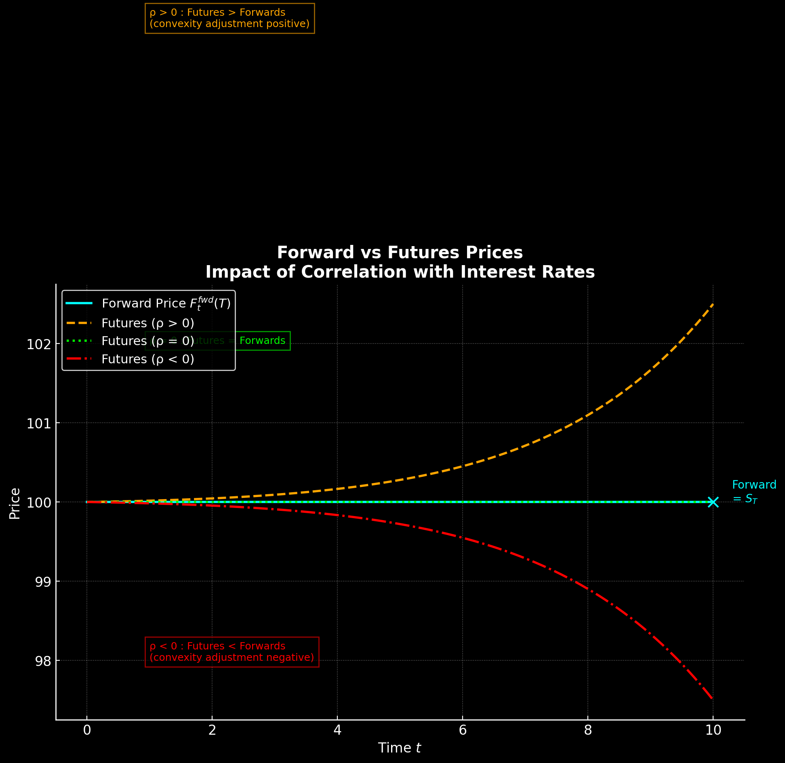

import ClearStarsButton from '@site/src/components/progress/ClearStarsButton';
import ChapterStars from '@site/src/components/progress/ChapterStars';

  <ChapterStars chapterId="convexity-adjustment" showLabel />
  <ClearStarsButton chapterId="convexity-adjustment" />

# 🔀 Forwards vs Futures & Convexity Adjustment

Forwards and futures look very similar: both are agreements to buy/sell an asset in the future at a fixed price.  
But the **timing of cash flows** creates a subtle — and important — difference when interest rates are stochastic.

---

## 1️⃣ Forward Contracts

A **forward contract** signed at time $$t$$ with maturity $$T$$:

- Obliges the long to **buy** the asset at $$T$$ for the forward price $$F_t^{\text{fwd}}(T)$$.  
- No cash flow at initiation.  
- Payoff at maturity:

$$
V_T^{\text{fwd}} = S_T - F_t^{\text{fwd}}(T).
$$

**Pricing (no dividends):**

By replication (cash-and-carry arbitrage):

$$
F_t^{\text{fwd}}(T) = S_t \, e^{r (T-t)}.
$$

With continuous dividend yield $$q$$:

$$
F_t^{\text{fwd}}(T) = S_t \, e^{(r - q)(T-t)}.
$$

---

## 2️⃣ Futures Contracts

A **futures contract** is similar to a forward, but:

- It is standardized and traded on an exchange.  
- Gains and losses are **settled daily (mark-to-market)** via margin accounts.  
- At maturity $$T$$, the payoff is the same as a forward:

$$
V_T^{\text{fut}} = S_T - F_t^{\text{fut}}(T).
$$

But unlike forwards, the intermediate daily cash flows matter.

---

## 3️⃣ Key Difference

- **Forward:** One cash flow at maturity.  
- **Future:** A sequence of daily settlements.

If interest rates are **deterministic**, both contracts have the same fair price:

$$
F_t^{\text{fut}}(T) = F_t^{\text{fwd}}(T).
$$

If rates are **stochastic**, they differ — because the cash flows from futures can be reinvested at random interest rates.

---

## 4️⃣ Mathematical Framework

### Forward Price under Risk-Neutral Measure

Under the risk-neutral measure $$\mathbb{Q}$$, with numéraire $$B_t = e^{\int_0^t r_s \, ds}$$:

$$
F_t^{\text{fwd}}(T) = \frac{1}{P(t,T)} \, \mathbb{E}_t^{\mathbb{Q}}[S_T],
$$

where $$P(t,T)$$ is the zero-coupon bond price.

### Futures Price under Futures Measure

Under the **futures measure** $$\mathbb{Q}^{\text{fut}}$$, with numéraire $$1$$ (the money-market account rebalanced daily), the futures price is:

$$
F_t^{\text{fut}}(T) = \mathbb{E}_t^{\mathbb{Q}^{\text{fut}}}[S_T].
$$

:::info 🔎 Futures Measure Explained

When we price forwards and futures, the key difference comes from the **measure** under which the asset price is a martingale.

---

### 1️⃣ Risk-Neutral Measure (forwards)

- **Numéraire:** Money-market account  
  $$ B_t = e^{\int_0^t r_s \, ds} $$  

- Under the risk-neutral measure $$ \mathbb{Q} $$:  

$$
\frac{S_t}{B_t} \quad \text{is a martingale}.
$$

- Forward price:  

$$
F_t^{\text{fwd}}(T) = \frac{1}{P(t,T)} \, \mathbb{E}_t^{\mathbb{Q}}[S_T],
$$

where $$ P(t,T) $$ is the zero-coupon bond price.

---

### 2️⃣ Daily Settlement in Futures

Futures contracts are **marked-to-market daily**:

- Gains and losses are realized each day.  
- They are immediately reinvested at that day’s short rate.  
- This changes the timing of cash flows compared to forwards.

---

### 3️⃣ Futures Measure $$ \mathbb{Q}^{fut} $$

We define a new measure so that:

$$
F_t^{\text{fut}}(T) = \mathbb{E}_t^{\mathbb{Q}^{\text{fut}}}[S_T].
$$

- Under this measure, the **futures price is a martingale without discounting**.  
- People often say its *“numéraire is 1”* because you no longer divide by $$B_t$$.  
  The effect of discounting is absorbed by daily settlement.

---

### 4️⃣ Link to Convexity Adjustment

The relationship between forwards and futures can be expressed as:

$$
F_t^{\text{fut}}(T) - F_t^{\text{fwd}}(T)
= \text{Cov}_t^{\mathbb{Q}}\!\Big(S_T, \tfrac{B_t}{B_T}\Big).
$$

- If $$S_T$$ is **positively correlated** with interest rates → futures price is higher.  
- If **negatively correlated** → futures price is lower.  

---

### ✅ Intuition

- **Forwards:** One settlement at $$T$$ → need discounting under risk-neutral measure.  
- **Futures:** Many settlements along the way → no discounting needed, so futures price is a martingale under its own measure.  
- That’s why we use the shorthand: *“numéraire = 1”*.

:::

---

## 5️⃣ Convexity Adjustment

The difference between futures and forwards comes from the change of measure:

$$
F_t^{\text{fut}}(T) - F_t^{\text{fwd}}(T)
= \text{Cov}_t^{\mathbb{Q}} \Big( S_T , \frac{B_t}{B_T} \Big).
$$

This is called the **convexity adjustment**.

- If $$S_T$$ is **positively correlated** with interest rates, the covariance is positive → futures price is higher than forward.  
- If $$S_T$$ is **negatively correlated**, the futures price is lower.

---

## 6️⃣ Approximate Formula

Suppose the underlying follows:

$$
\frac{dS_t}{S_t} = \mu \, dt + \sigma_S \, dW_t^S, \quad
dr_t = \theta \, dt + \sigma_r \, dW_t^r,
$$

with correlation $$\rho$$ between Brownian motions.

Then, under some approximations (Hull–White model for rates), the convexity adjustment is:

$$
F_t^{\text{fut}}(T) \approx F_t^{\text{fwd}}(T) \, \exp\Big( \tfrac{1}{2} \, \sigma_S \, \sigma_r \, \rho \, (T-t)^2 \Big).
$$

This correction term reflects the joint volatility of the asset and interest rates.

:::info
## 🔎 Deriving the Convexity Adjustment Intuition

Suppose the underlying asset and the short rate follow correlated stochastic processes:

$$
\frac{dS_t}{S_t} = \mu \, dt + \sigma_S \, dW_t^S,
\qquad
dr_t = \theta \, dt + \sigma_r \, dW_t^r,
$$

with correlation:

$$
dW_t^S \, dW_t^r = \rho \, dt.
$$

---

### 1️⃣ Forward Price Definition

The **forward price** under the $T$-forward measure is:

$$
F_t^{fwd}(T) = \mathbb{E}_t^{\mathbb{Q}^T}[S_T].
$$

This expectation uses the **discount bond $P(t,T)$** as numéraire, so the drift of $S_t$ is adjusted accordingly.

:::note
## 📌 Forward as a Martingale under the $$T$$-Forward Measure

We show that the forward price process $$F_u^{\text{fwd}}(T)_{u \le T} $$ is a **martingale** under the $$T$$-forward measure $$ \mathbb{Q}^T $$. In particular,
$$
F_t^{\text{fwd}}(T) \;=\; \mathbb{E}_t^{\mathbb{Q}^T}\!\big[F_T^{\text{fwd}}(T)\big].
$$

---

### 1) Pricing with the $$T$$-bond numéraire

Let $$P(t,T)$$ be the price at time $$t$$ of a zero-coupon bond maturing at $$T$$.
Under the $$T$$-forward measure $$ \mathbb{Q}^T $$ (numéraire $$P(\cdot,T)$$), any payoff $$X_T$$ delivered at $$T$$ has time-$$t$$ price
$$
V_t \;=\; P(t,T)\,\mathbb{E}_t^{\mathbb{Q}^T}[\,X_T\,].
$$

---

### 2) Forward price as normalized $$T$$-claim on $$S_T$$

The $$T$$-maturity **forward price** on the asset is the price today of receiving $$S_T$$ at $$T$$, **normalized by** the $$T$$-bond:
$$
F_t^{\text{fwd}}(T)
\;\equiv\;
\frac{V_t(\text{deliver }S_T)}{P(t,T)}
\;=\;
\mathbb{E}_t^{\mathbb{Q}^T}[\,S_T\,].
$$

More generally, at any $$u \in [t,T]$$:
$$
F_u^{\text{fwd}}(T) \;=\; \mathbb{E}_u^{\mathbb{Q}^T}[\,S_T\,].
$$

---

### 3) Martingale property (tower rule)

For $$t \le u \le T$$, apply iterated expectations under $$ \mathbb{Q}^T $$:
$$
\mathbb{E}_t^{\mathbb{Q}^T}\!\big[F_u^{\text{fwd}}(T)\big]
\;=\;
\mathbb{E}_t^{\mathbb{Q}^T}\!\big[\,\mathbb{E}_u^{\mathbb{Q}^T}[S_T]\,\big]
\;=\;
\mathbb{E}_t^{\mathbb{Q}^T}[S_T]
\;=\;
F_t^{\text{fwd}}(T).
$$

Thus $$ \{F_u^{\text{fwd}}(T)\} $$ is a $$ \mathbb{Q}^T $$-martingale.

---

### 4) Specializing to $$u=T$$

At maturity, the fair forward price **equals the spot** (no time left, no carry):
$$
F_T^{\text{fwd}}(T) \;=\; S_T.
$$

Therefore,
$$
F_t^{\text{fwd}}(T)
\;=\;
\mathbb{E}_t^{\mathbb{Q}^T}[\,S_T\,]
\;=\;
\mathbb{E}_t^{\mathbb{Q}^T}\!\big[F_T^{\text{fwd}}(T)\big].
$$

This is exactly the martingale statement you wanted.

---

### ✅ Takeaway
- Using $$P(\cdot,T)$$ as numéraire makes $$F^{\text{fwd}}(\cdot,T)$$ a **martingale** under $$ \mathbb{Q}^T $$.
- The identity
  $$
  F_t^{\text{fwd}}(T) \;=\; \mathbb{E}_t^{\mathbb{Q}^T}\!\big[F_T^{\text{fwd}}(T)\big]
  $$
  follows immediately from the **tower property** and the terminal condition $$F_T^{\text{fwd}}(T)=S_T$$.

---
:::
:::info

---

### 2️⃣ Futures Price Definition

The **futures price** is the expectation under the **futures measure**:

$$
F_t^{fut}(T) = \mathbb{E}_t^{\mathbb{Q}^{fut}}[S_T],
$$

with the **money-market account (daily rebalanced)** as numéraire.

---

### 3️⃣ Relating Forward and Futures Measures

To compare **forwards** and **futures**, we need to switch probability measures.

- The **forward measure** $\mathbb{Q}^T$ uses the **zero-coupon bond $P(t,T)$** as numéraire.  
- The **futures measure** $\mathbb{Q}^{fut}$ uses the **money-market account rebalanced daily** as numéraire.

By the **change-of-numéraire theorem**, expectations under one measure can be expressed under another using a **Radon–Nikodym derivative** (stochastic discount factor).  

For any payoff $X_T$, the relationship is:

$$
\mathbb{E}_t^{\mathbb{Q}^{fut}}[X_T]
=
\frac{\mathbb{E}_t^{\mathbb{Q}}\!\big[X_T \cdot M_T \big]}
     {\mathbb{E}_t^{\mathbb{Q}}[M_T]},
$$

where:

- $\mathbb{Q}$ = risk-neutral measure (numéraire = money market account without daily reset),  
- $M_T$ = stochastic discount factor that accounts for the change from $\mathbb{Q}$ to $\mathbb{Q}^{fut}$.

Applying this to $S_T$ gives:

$$
F_t^{fut}(T) = \mathbb{E}_t^{\mathbb{Q}^{fut}}[S_T]
= \frac{\mathbb{E}_t^{\mathbb{Q}}[S_T \cdot M_T]}{\mathbb{E}_t^{\mathbb{Q}}[M_T]}.
$$

---

### 4️⃣ Expansion Around the Forward Price

Now expand the numerator using the **definition of covariance**:

$$
\mathbb{E}_t^{\mathbb{Q}}[S_T \cdot M_T]
= \mathbb{E}_t^{\mathbb{Q}}[S_T] \cdot \mathbb{E}_t^{\mathbb{Q}}[M_T]
+ \text{Cov}_t^{\mathbb{Q}}(S_T, M_T).
$$

Plugging this back:

$$
F_t^{fut}(T)
= \frac{ \mathbb{E}_t^{\mathbb{Q}}[S_T] \cdot \mathbb{E}_t^{\mathbb{Q}}[M_T]
+ \text{Cov}_t^{\mathbb{Q}}(S_T, M_T) }
{\mathbb{E}_t^{\mathbb{Q}}[M_T]}.
$$

$$
F_t^{fut}(T)
= \mathbb{E}_t^{\mathbb{Q}}[S_T]
+ \frac{ \text{Cov}_t^{\mathbb{Q}}(S_T, M_T) }
       { \mathbb{E}_t^{\mathbb{Q}}[M_T] }.
$$

Simplify:

$$
F_t^{fut}(T) = \mathbb{E}_t^{\mathbb{Q}^T}[S_T]
+ \text{Cov}_t^{\mathbb{Q}}(S_T, M_T).
$$

:::note

### Normalization of $$M_T$$

Now, the trick:

- If we define $$M_T$$ as the **Radon–Nikodym derivative** of $$\mathbb{Q}^{fut}$$ relative to $$\mathbb{Q}$$,  
  then by construction:

$$
\mathbb{E}_t^{\mathbb{Q}}[M_T] = 1.
$$

- In that case, the denominator disappears, and we get the simplified (but slightly abusive) form:

$$
F_t^{fut}(T) =
\mathbb{E}_t^{\mathbb{Q}}[S_T]
+ \text{Cov}_t^{\mathbb{Q}}(S_T, M_T).
$$

---

### Conclusion

- **Full general form (always true):**

$$
F_t^{fut}(T) =
F_t^{fwd}(T) + 
\frac{\text{Cov}_t^{\mathbb{Q}}(S_T, M_T)}{\mathbb{E}_t^{\mathbb{Q}}[M_T]}.
$$

- **Simplified form (if $$M_T$$ normalized so that $$E[M_T]=1$$):**

$$
F_t^{fut}(T) =
F_t^{fwd}(T) + \text{Cov}_t^{\mathbb{Q}}(S_T, M_T).
$$

So the missing denominator was not “forgotten” — it was absorbed by the assumption that $$M_T$$ is already normalized.

:::

:::info

But:

$$
\mathbb{E}_t^{\mathbb{Q}^T}[S_T] = F_t^{fwd}(T).
$$

Hence:

$$
F_t^{fut}(T) \;\approx\; F_t^{fwd}(T) \;+\; \text{Cov}_t\big(S_T, \text{discount factors}\big).
$$

:::note
## ❓ Why Do We Often See
$$
F_t^{fut}(T) \;\approx\; F_t^{fwd}(T) + \text{Cov}_t(S_T, \text{discount factors}) \, ?
$$

---

### 1️⃣ General Formula

From the change-of-numéraire argument, the exact relation is:

$$
F_t^{fut}(T) =
F_t^{fwd}(T) \;+\;
\frac{\text{Cov}_t^{\mathbb{Q}}(S_T, M_T)}
     {\mathbb{E}_t^{\mathbb{Q}}[M_T]}.
$$

---

### 2️⃣ Normalization of $$M_T$$

If $$M_T$$ is defined as the **Radon–Nikodym derivative** of the futures measure relative to $$\mathbb{Q}$$, then by construction:

$$
\mathbb{E}_t^{\mathbb{Q}}[M_T] = 1.
$$

So the formula simplifies to:

$$
F_t^{fut}(T) =
F_t^{fwd}(T) + \text{Cov}_t^{\mathbb{Q}}(S_T, M_T).
$$

:::note

# Radon–Nikodym Derivative of the Futures Measure Relative to $$Q$$

## 1. Background on Change of Measure
In mathematical finance, a **change of measure** allows us to switch between probability measures associated with different numeraires.  

- Let $$Q^N$$ be the probability measure associated with numeraire $$N_t$$.  
- Let $$Q^M$$ be the probability measure associated with numeraire $$M_t$$.  

The Radon–Nikodym (RN) derivative between them is given by:
$$
\frac{dQ^{M}}{dQ^{N}}_{\mathcal F_t}
= \frac{M_t/N_t}{M_0/N_0}.
$$

This formula ensures that discounted asset prices remain martingales under the new measure.

---

## 2. Risk-Neutral Measure $$Q$$
The **risk-neutral measure** $$Q$$ is defined with respect to the **money-market account** (or bank account) $$B_t$$, where:
$$
B_t = e^{\int_0^t r_s \, ds}.
$$

Thus, $$Q$$ is the measure associated with the numeraire $$B_t$$.

---

## 3. Futures Measure
The **futures measure** is also defined with respect to the **money-market account** as numeraire. This is because the mark-to-market nature of futures contracts effectively removes discounting, and the bank account serves as the natural numeraire.

Therefore:
$$
Q^{\text{fut}} \equiv Q.
$$

---

## 4. Radon–Nikodym Derivative: Futures Measure vs. $$Q$$
Since both the risk-neutral measure and the futures measure use the **same numeraire** ($$B_t$$), the two measures coincide. Hence, their Radon–Nikodym derivative is simply:

$$
\left.\frac{dQ^{\text{fut}}}{dQ}\right|_{\mathcal F_t} = 1, 
\qquad \forall t.
$$

---

## 5. Comparison: Forward Measure Case
If instead we considered the **$$T$$-forward measure** $$Q^T$$ (with zero-coupon bond $$P(t,T)$$ as numeraire), then relative to $$Q$$ we have:

$$
\left.\frac{dQ^{T}}{dQ}\right|_{\mathcal F_t}
= \frac{B_t\,P(0,T)}{B_0\,P(t,T)}.
$$

This highlights the difference:  
- Futures measure = identical to $$Q$$.  
- Forward measure = different from $$Q$$, with RN derivative given above.

---

## 6. Conclusion
- For the **futures measure**, the Radon–Nikodym derivative relative to $$Q$$ is **1 everywhere**.  
- For the **forward measure**, the RN derivative takes a non-trivial form depending on the bank account and bond prices.
:::

---

### 3️⃣ Why the "≈" (Approximation)

Even with normalization, people often write:

$$
F_t^{fut}(T) \;\approx\; F_t^{fwd}(T) + \text{Cov}_t(S_T, \text{discount factors}).
$$

for two reasons:

1. **Interpretation shortcut**  
   Instead of carrying the exact Radon–Nikodym derivative $$M_T$$, practitioners talk loosely about "discount factors".  
   The covariance term then becomes a heuristic link between stochastic interest rates and futures/forwards difference.

2. **Small adjustment**  
   In practice, the convexity adjustment is typically **small** (especially for short maturities or low rate vol).  
   So the covariance term is treated as a *correction* to the forward price — hence the "≈".

---

### ✅ Key Point

- If $$E[M_T]=1$$, the formula is **exact**.  
- The "≈" is used in textbooks and interviews to emphasize that the **main driver is the covariance term**, while the correction is usually of **second order**.  
- For long maturities and high interest rate volatility, this adjustment becomes significant.

:::

---

### 5️⃣ Interpretation

- If **$S_T$ and discount factors are uncorrelated** → the covariance term vanishes and $F_t^{fut}(T) = F_t^{fwd}(T)$.
- If **$S_T$ is positively correlated with interest rates**:
  - When $S_T$ is high, interest rates are also high → discount factors are small.
  - This **boosts futures prices** relative to forwards.
- If **$S_T$ is negatively correlated with rates** → adjustment goes the other way.

---

### ✅ Conclusion

The **convexity adjustment** originates from this covariance term:

$$
F_t^{fut}(T) - F_t^{fwd}(T)
= \text{Cov}_t \big( S_T , \text{discount factors} \big).
$$

This is why under stochastic interest rates, futures are **not equal** to forwards.

:::

---

## 7️⃣ Intuition

- **Forward = single payment at maturity.**  
  Discounting applies once, at $$T$$.  

- **Future = daily settlements.**  
  Gains are received early and reinvested. Losses are paid early.  

If gains tend to occur when interest rates are high → futures are more valuable.  
If gains occur when rates are low → futures are less valuable.

---

## 8️⃣ Example: Interest Rate Futures

For **Eurodollar futures**, the convexity adjustment is well-known.  
If forward rate is $$F_t$$, then futures rate is approximately:

$$
F_t^{\text{fut}} \approx F_t^{\text{fwd}} + \tfrac{1}{2} \, \sigma_r^2 \, (T-t)^2.
$$

Here the adjustment is always **positive** because higher rates increase reinvestment returns.

---

## ✅ Summary

- For deterministic rates:  
  $$ F^{\text{fut}} = F^{\text{fwd}}. $$

- For stochastic rates:  
  $$ F^{\text{fut}} = F^{\text{fwd}} + \text{Convexity Adjustment}. $$

- The adjustment depends on the **correlation between asset price and rates**.  
- Critical in pricing **interest-rate futures** (Eurodollar, SOFR) and in risk management.

---

On that convexity bias graph, the “Yield %” on the x-axis refers to a deterministic fixed rate (like a quoted yield-to-maturity or short-term risk-free rate used for discounting)

## 🔄 Forward vs Futures Convexity: Yield vs Time

Convexity effects can look *opposite* depending on whether we vary the **yield** or the **time-to-maturity**.  
Let’s reconcile the two perspectives.

---

### 1️⃣ Forward as a Function of Yield

For a fixed maturity $$T$$, the forward price is:

$$
F_t^{fwd}(T) = S_t \, e^{(r-q)(T-t)}.
$$

- As a function of the yield $$r$$, this is **exponential**.  
- Exponentials are convex in $$r$$.  

So, in a **Price vs Yield** graph:

- **Forward = convex curve**.  
- **Futures = linear** (since daily settlement eliminates discounting).  

---

### 2️⃣ Futures as a Function of Time

Now consider maturity $$T$$ increasing with **stochastic rates**.  
The futures price differs from the forward due to a covariance term:

$$
F_t^{fut}(T) = F_t^{fwd}(T) + \text{Cov}_t \big(S_T, M_T\big),
$$

where $$M_T$$ is the stochastic discount factor.

- If $$S_T$$ and $$M_T$$ are positively correlated, this term is **positive**.  
- The effect **grows with time** (longer horizon = more accumulated covariance).  

So, in a **Price vs Time** graph:

- **Futures = convex curve above forwards**.  
- **Forward = baseline curve**.  

---

### 3️⃣ Reconciling the Two Views

- **In Yield Space (fix $$T$$):**  
  Convexity comes from the exponential discount factor.  
  → **Forward is convex**, futures is linear.  

- **In Time Space (fix stochastic $$r_t$$):**  
  Convexity comes from correlation between underlying and discounting.  
  → **Futures are convex-adjusted**, forwards are the baseline.  

---

✅ **Key Insight:**  
Convexity is about **curvature of expectations**.  
Which contract (forward vs futures) looks convex depends on whether you look across **yields** or across **time horizons**.

import TryIt from '@site/src/components/tryit/TryIt';

## Practice — overview

- **Discount factor (deterministic)** — implement `discount_factor(r, t, T)` → `e^{-r(T−t)}`.
- **Forward with yield** — `forward_yield(S, r, q, t, T)` → `S * e^{(r−q)(T−t)}`.
- **Fut=Fwd when rates deterministic** — `fut_minus_fwd_det(S, r, q, t, T)` → should be ~0.
- **Convexity approx (asset & rates vol)** — `futures_from_forward_approx(Ff, sigmaS, sigmaR, rho, tau)`.
- **Eurodollar (rate) convexity** — `eurodollar_fut_from_fwd(Ff, sigmaR, tau)` ≈ `Ff + 0.5 σ_r^2 τ^2`.
- **Sign from correlation** — `convexity_sign(rho)` → `'fut>fwd' | 'equal' | 'fut<fwd'`.
- **Forward from expectation** — `forward_from_expect(E_ST, P_tT)` → `E_ST / P_tT`.
- **Measure link (cov form)** — `futures_from_cov(Ff, cov, denom)` → `Ff + cov/denom`.
- **Diff from cov term** — `diff_from_cov(cov, denom)` → `cov/denom`.
- **Sensitivity (delta adjustment)** — `convexity_delta(Ff, sigmaS, sigmaR, rho, tau)` → `F_fut − F_fwd`.

## Practice — Try it Yourself

<TryIt
  id="convexity-lab"
  chapterId="convexity-adjustment"
  title="Forwards vs Futures — Convexity Lab"
  intro="Implement each function, then Run tests. 10 exercises, 2 tests each. Each pass is worth 0.3★ (total 3★)."
  hideTiles
  starTotal={3}
  packWeight={0.3}
  packs={[
    {
      id: 'df_det',
      name: '⭐ Discount factor (deterministic)',
      desc: 'Return exp(-r*(T - t)).',
      detect: "def\\s+discount_factor\\s*\\(",
      scaffold: `import math

def discount_factor(r, t, T):
    """Deterministic discount factor: exp(-r*(T - t))"""
    # TODO
    return 0.0
`,
      hint: `Use math.exp(-r*(T - t))`,
      tests: [
        { expr: ['import math','discount_factor(0.05,0.0,1.0)'].join('; '), expected: Number((Math.exp(-0.05*1.0)).toFixed(12)), tol: 1e-10 },
        { expr: ['import math','discount_factor(0.03,0.5,2.0)'].join('; '), expected: Number((Math.exp(-0.03*(2.0-0.5))).toFixed(12)), tol: 1e-10 },
      ],
    },
    {
      id: 'fwd_yield',
      name: '⭐ Forward with yield',
      desc: 'F = S * exp((r - q)*(T - t)).',
      detect: "def\\s+forward_yield\\s*\\(",
      scaffold: `import math

def forward_yield(S, r, q, t, T):
    """Forward with continuous dividend yield q"""
    # TODO
    return 0.0
`,
      hint: `S * math.exp((r - q)*(T - t))`,
      tests: [
        { expr: ['import math','forward_yield(100,0.02,0.03,0,1)'].join('; '), expected: Number((100*Math.exp((0.02-0.03)*1)).toFixed(9)), tol: 1e-6 },
        { expr: ['import math','forward_yield(250,0.01,0.00,0,2)'].join('; '), expected: Number((250*Math.exp((0.01-0.0)*2)).toFixed(9)), tol: 1e-6 },
      ],
    },
    {
      id: 'det_eq',
      name: '⭐ Futures = Forward when rates deterministic',
      desc: 'Return F_fut - F_fwd (should be ~0).',
      detect: "def\\s+fut_minus_fwd_det\\s*\\(",
      scaffold: `import math

def fut_minus_fwd_det(S, r, q, t, T):
    """With deterministic r, futures and forward match. Return their difference."""
    # TODO: compute both via forward_yield and subtract
    return 0.0
`,
      hint: `Use your forward_yield for both; difference ~0`,
      tests: [
        { expr: ['import math','S=120;r=0.02;q=0.01;t=0;T=1.5','fut_minus_fwd_det(S,r,q,t,T)'].join('; '), expected: 0.0, tol: 1e-9 },
        { expr: ['import math','S=80;r=0.03;q=0.0;t=0;T=0.75','fut_minus_fwd_det(S,r,q,t,T)'].join('; '), expected: 0.0, tol: 1e-9 },
      ],
    },
    {
      id: 'convexity_exp',
      name: '⭐ Convexity approx (σ_S, σ_r, ρ)',
      desc: 'F_fut ≈ F_fwd * exp(0.5*σS*σr*ρ*τ²). Return F_fut.',
      detect: "def\\s+futures_from_forward_approx\\s*\\(",
      scaffold: `import math

def futures_from_forward_approx(Ff, sigmaS, sigmaR, rho, tau):
    """Hull-style convexity approx: F_fut = Ff * exp(0.5*sigmaS*sigmaR*rho*tau*tau)"""
    # TODO
    return 0.0
`,
      hint: `exp(0.5*sigmaS*sigmaR*rho*tau*tau)`,
      tests: [
        { expr: ['import math','Ff=100;sS=0.2;sR=0.01;rho=0.5;tau=1.0','futures_from_forward_approx(Ff,sS,sR,rho,tau)'].join('; '),
          expected: Number((100*Math.exp(0.5*0.2*0.01*0.5*1.0*1.0)).toFixed(9)), tol: 1e-6 },
        { expr: ['import math','Ff=150;sS=0.25;sR=0.02;rho=-0.3;tau=2.0','futures_from_forward_approx(Ff,sS,sR,rho,tau)'].join('; '),
          expected: Number((150*Math.exp(0.5*0.25*0.02*(-0.3)*4)).toFixed(9)), tol: 1e-6 },
      ],
    },
    {
      id: 'eurodollar',
      name: '⭐ Eurodollar convexity (rate only)',
      desc: 'F_fut ≈ F_fwd + 0.5 * σ_r² * τ².',
      detect: "def\\s+eurodollar_fut_from_fwd\\s*\\(",
      scaffold: `import math

def eurodollar_fut_from_fwd(Ff, sigmaR, tau):
    """Approx: F_fut = Ff + 0.5*sigmaR*sigmaR*tau*tau"""
    # TODO
    return 0.0
`,
      hint: `0.5*sigmaR*sigmaR*tau*tau`,
      tests: [
        { expr: ['import math','eurodollar_fut_from_fwd(5.0,0.01,1.0)'].join('; '), expected: Number((5.0 + 0.5*0.01*0.01*1.0*1.0).toFixed(12)), tol: 1e-12 },
        { expr: ['import math','eurodollar_fut_from_fwd(3.2,0.02,0.5)'].join('; '), expected: Number((3.2 + 0.5*0.02*0.02*0.25).toFixed(12)), tol: 1e-12 },
      ],
    },
    {
      id: 'sign',
      name: '⭐ Sign from correlation',
      desc: "Return 'fut>fwd' if ρ>0, 'equal' if ρ=0, 'fut<fwd' if ρ<0.",
      detect: "def\\s+convexity_sign\\s*\\(",
      scaffold: `def convexity_sign(rho):
    """Return 'fut>fwd' | 'equal' | 'fut<fwd' based on rho"""
    # TODO
    return ''
`,
      hint: `Simple if/elif/else on rho`,
      tests: [
        { expr: ['convexity_sign(0.4)'].join('; '), expected: 'fut>fwd', tol: 0 },
        { expr: ['convexity_sign(-0.1)'].join('; '), expected: 'fut<fwd', tol: 0 },
      ],
    },
    {
      id: 'fwd_from_expect',
      name: '⭐ Forward from expectation',
      desc: 'F_fwd = E[S_T] / P(t,T).',
      detect: "def\\s+forward_from_expect\\s*\\(",
      scaffold: `def forward_from_expect(E_ST, P_tT):
    """Forward under risk-neutral: E[S_T] divided by zero-coupon price P(t,T)."""
    # TODO
    return 0.0
`,
      hint: `Just division (assume P_tT>0)`,
      tests: [
        { expr: ['forward_from_expect(105.0, 0.95)'].join('; '), expected: Number((105/0.95).toFixed(9)), tol: 1e-6 },
        { expr: ['forward_from_expect(200.0, 0.90)'].join('; '), expected: Number((200/0.90).toFixed(9)), tol: 1e-6 },
      ],
    },
    {
      id: 'cov_link',
      name: '⭐ Measure link (cov form)',
      desc: 'F_fut = F_fwd + cov/denom.',
      detect: "def\\s+futures_from_cov\\s*\\(",
      scaffold: `def futures_from_cov(Ff, cov, denom):
    """General link: F_fut = Ff + cov/denom (denom > 0)."""
    # TODO
    return 0.0
`,
      hint: `Return Ff + cov/denom`,
      tests: [
        { expr: ['futures_from_cov(100.0, 0.25, 1.0)'].join('; '), expected: 100.25, tol: 1e-12 },
        { expr: ['futures_from_cov(80.0, -0.10, 2.0)'].join('; '), expected: 79.95, tol: 1e-12 },
      ],
    },
    {
      id: 'cov_diff',
      name: '⭐ Diff from cov term',
      desc: 'Δ = cov/denom.',
      detect: "def\\s+diff_from_cov\\s*\\(",
      scaffold: `def diff_from_cov(cov, denom):
    """Return cov/denom (assume denom>0)."""
    # TODO
    return 0.0
`,
      hint: `One-liner`,
      tests: [
        { expr: ['diff_from_cov(0.06, 3.0)'].join('; '), expected: 0.02, tol: 1e-12 },
        { expr: ['diff_from_cov(-0.09, 0.5)'].join('; '), expected: -0.18, tol: 1e-12 },
      ],
    },
    {
      id: 'conv_delta',
      name: '⭐ Sensitivity: F_fut − F_fwd',
      desc: 'Return delta = Ff*(exp(0.5*σS*σr*ρ*τ²) − 1).',
      detect: "def\\s+convexity_delta\\s*\\(",
      scaffold: `import math

def convexity_delta(Ff, sigmaS, sigmaR, rho, tau):
    """Return F_fut - F_fwd under the log-linear approx."""
    # TODO
    return 0.0
`,
      hint: `Ff*(math.exp(0.5*sigmaS*sigmaR*rho*tau*tau)-1.0)`,
      tests: [
        { expr: ['import math','convexity_delta(120,0.2,0.02,0.4,1.0)'].join('; '),
          expected: Number((120*(Math.exp(0.5*0.2*0.02*0.4*1)-1)).toFixed(9)), tol: 1e-6 },
        { expr: ['import math','convexity_delta(90,0.25,0.015,-0.3,2.0)'].join('; '),
          expected: Number((90*(Math.exp(0.5*0.25*0.015*(-0.3)*4)-1)).toFixed(9)), tol: 1e-6 },
      ],
    },
  ]}
/>
