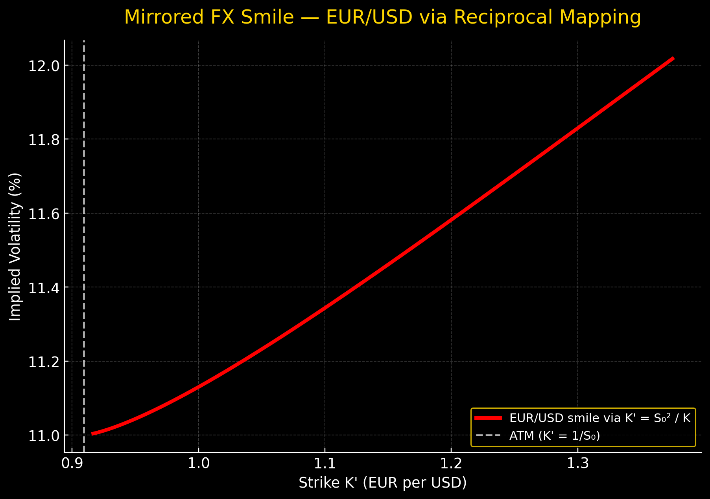
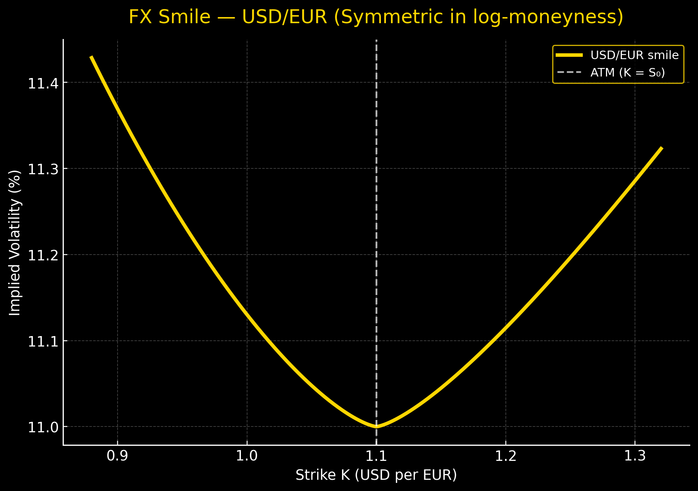
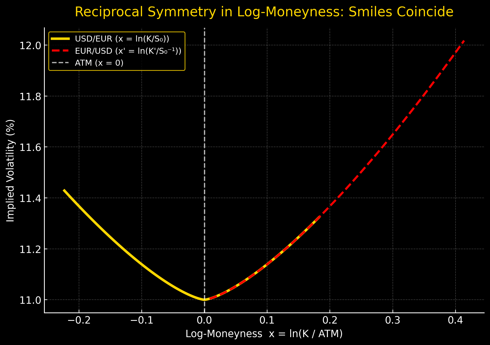

# 💱 FX Volatility and Symmetry

> *“In currencies, what goes down for one side, goes up for another.”*  
> — **Principle of Symmetric Risk**

---

## 🟡 1️⃣ Introduction — The Dual Nature of FX

Unlike equities or credit assets, **foreign exchange (FX)** markets have **no natural “upside” or “downside”**.  
Every exchange rate is a *relative price*:

$$
S_t = \frac{Value\ of\ 1\ Unit\ of\ Currency\ A}{Value\ of\ Currency\ B}.
$$

Thus, if EUR/USD rises, USD/EUR necessarily falls:

$$
S_t^{(EUR/USD)} = \frac{1}{S_t^{(USD/EUR)}}.
$$

From this simple identity, deep implications follow for **volatility**, **options**, and **risk symmetry**.

---

## ⚖️ 2️⃣ The Reciprocity Principle

Let $$ S_t $$ denote an exchange rate and $$ X_t = 1/S_t $$ its reciprocal.  
By Itô’s lemma:

$$
dX_t = -\frac{1}{S_t^2} dS_t + \frac{1}{S_t^3} (dS_t)^2
$$

If $$ S_t $$ follows a lognormal process under the risk-neutral measure $$ \mathbb{Q} $$:

$$
\frac{dS_t}{S_t} = (r_d - r_f) dt + \sigma_t dW_t,
$$

then $$ X_t = 1/S_t $$ satisfies:

$$
\frac{dX_t}{X_t} = (r_f - r_d) dt + \sigma_t dW_t',
$$

where $$ dW_t' = -dW_t $$.

**Conclusion:**  
Both processes share **the same instantaneous volatility** $$ \sigma_t $$. Hence, volatility is **invariant to currency inversion**.

---

## 💎 3️⃣ Symmetry of the Implied Volatility Surface

The **implied volatility surface** $$ \sigma_{imp}(K, T) $$ in FX must satisfy the *reciprocal symmetry* constraint:

$$
\sigma_{imp}(K,T; S_0)
=
\sigma_{imp}\!\left(\frac{S_0^2}{K},T; \frac{1}{S_0}\right).
$$

That is, the implied volatility for a strike $$ K $$ in USD/EUR  
is identical to that for $$ S_0^2 / K $$ in EUR/USD.

Mathematically, this implies the **volatility smile must be even** in log-moneyness:

$$
\ln\frac{K}{S_0} \;\; \to \;\; -\ln\frac{K}{S_0}.
$$

So:

$$
\sigma_{imp}(K,T) = f\!\left(\Big|\ln\frac{K}{S_0}\Big|\right),
$$

yielding a **U-shaped smile**, symmetric around the at-the-money (ATM) level.

# 🔁 FX Reciprocal Symmetry in Implied Volatility

In **foreign exchange (FX)** markets, every currency pair has a **reciprocal quote**.  
For example, if:

$$
S_0 = \text{USD/EUR spot rate}, \quad \text{then} \quad \frac{1}{S_0} = \text{EUR/USD}.
$$

When quoting options, this duality imposes a **symmetry constraint** on the **implied volatility surface**:

$$
\sigma_{imp}(K, T; S_0)
=
\sigma_{imp}\!\left(\frac{S_0^2}{K}, T; \frac{1}{S_0}\right).
$$

---

## 🧩 Intuition

This property ensures that **pricing is invariant** whether you model options on  
USD/EUR or EUR/USD — both must yield **the same no-arbitrage prices** when converted through the exchange rate.

In other words:

- A **call option** on USD/EUR with strike $$ K $$  
  must have the same implied volatility as  
  a **put option** on EUR/USD with strike $$ \frac{S_0^2}{K} $$.  
- Otherwise, there would be an **arbitrage opportunity** between the two mirrored FX options.

---

## ⚙️ Mathematical Formulation

The price of an FX option under the domestic risk-neutral measure is:

$$
C_{FX}(K, T) = e^{-r_d T}\, \mathbb{E}^{\mathbb{Q}_d}[(S_T - K)^+],
$$

where:
- $$ r_d $$ = domestic interest rate  
- $$ r_f $$ = foreign interest rate  
- $$ S_T $$ = spot rate at maturity (domestic per foreign currency)

Under the **foreign measure** $$ \mathbb{Q}_f $$, the same option can be rewritten as:

$$
C_{FX}^{(f)}\!\left(\frac{S_0^2}{K}, T\right)
= e^{-r_f T}\, \mathbb{E}^{\mathbb{Q}_f}\!\left[\left(\frac{1}{S_T} - \frac{1}{K'}\right)^+\right],
$$

where $$ K' = \frac{S_0^2}{K} $$.

## 🔄 Why $$ K' = \frac{S_0^2}{K} $$

When switching from **USD/EUR** to **EUR/USD**, both the **underlying** and the **strike** must be transformed so that the option payoffs remain economically equivalent.

---

### 1️⃣ Start from the USD/EUR Call Option

A **call option on USD/EUR** gives the holder the right to buy 1 EUR for $$ K $$ USD at maturity:

$$
\text{Payoff}_{USD/EUR} = (S_T - K)^+,
$$

where:

- $$ S_T $$ = USD per EUR at maturity (the FX rate)
- $$ K $$ = strike in USD per EUR  

---

### 2️⃣ Express the Same Payoff in Terms of EUR/USD

Now, in the **EUR/USD world**, we quote the *inverse* exchange rate:

$$
\tilde{S}_T = \frac{1}{S_T} \quad \text{(EUR per USD)}.
$$

Then the payoff, denominated in EUR, becomes:

$$
\text{Payoff}_{EUR/USD}
= \left(\frac{1}{\tilde{S}_T} - K \right)^+
= \frac{1}{\tilde{S}_T} \left(1 - K \tilde{S}_T\right)^+.
$$

This looks like a **put option** on EUR/USD with strike:

$$
K' = \frac{1}{K}.
$$

But — we must also scale by the **current spot rate** $$ S_0 $$ to keep the contract sizes consistent (since one contract is per EUR, the other per USD).

---

### 3️⃣ Adjust for the Change of Numéraire

The two option markets (USD/EUR and EUR/USD) use different *notional units*:

- The USD/EUR option payoff is in **USD**.  
- The EUR/USD option payoff is in **EUR**.  

To make them *comparable under no-arbitrage*, we rescale the strike by $$ S_0^2 $$:

$$
K' = \frac{S_0^2}{K}.
$$

This ensures that the **value of the mirrored option** under the foreign measure
matches that under the domestic one when both are converted into the same currency.

---

### 4️⃣ Intuitive Check

If the current spot is $$ S_0 = 1.10 $$ (USD/EUR), and the USD/EUR call has strike $$ K = 1.20 $$:

Then the corresponding **EUR/USD** put option has strike:

$$
K' = \frac{1.10^2}{1.20} = 1.008.
$$

That means:  
A call on EUR/USD at 1.008 EUR per USD has the *same implied volatility* as the call on USD/EUR at 1.20 USD per EUR — under the reciprocal symmetry condition.

---

### ✅ Summary

| Concept | USD/EUR (domestic = USD) | EUR/USD (domestic = EUR) |
|:--|:--|:--|
| Spot | $$ S_0 $$ | $$ 1/S_0 $$ |
| Strike | $$ K $$ | $$ K' = S_0^2 / K $$ |
| Measure | $$ \mathbb{Q}_{USD} $$ | $$ \mathbb{Q}_{EUR} $$ |
| Relation |  |  |
| **Implied vol symmetry** |  | $$ \sigma_{imp}(K,T; S_0) = \sigma_{imp}(S_0^2/K,T; 1/S_0) $$ |

---

:::info 💡
The transformation $$ K' = S_0^2 / K $$ arises because switching between USD/EUR and EUR/USD  
involves **both inverting the rate** and **changing the currency numéraire**, which requires a square scaling in the spot rate to maintain parity.
:::

By enforcing **no-arbitrage parity** between domestic and foreign measures, we derive:

$$
\sigma_{imp}(K, T; S_0)
=
\sigma_{imp}\!\left(\frac{S_0^2}{K}, T; \frac{1}{S_0}\right).
$$

---

## 💡 Interpretation

- The **volatility smile** in FX must be **symmetric in log-moneyness**, unlike equities.  
- The reason is that in FX, **neither currency is the numéraire by default** — both can be chosen.  
- Pricing consistency requires this **reciprocal symmetry**, leading to symmetric smiles.  
- In contrast, equities exhibit **negative skew** because equity options are quoted in a **single numéraire (cash)** and downside risk dominates.

---

:::info 🔍 Key Takeaway
FX implied volatility surfaces are **self-consistent under inversion** of the currency pair.
This symmetry constraint ensures **no-arbitrage** between USD/EUR and EUR/USD options.
:::

---

## Volatility Smile Formula (FX / Commodities)

Empirical studies (Derman, Dupire, Hagan) show that FX smiles can be modeled as:

$$
\sigma_{imp}(K,T)
=
\sigma_{ATM} + a \Big|\ln\frac{K}{S_0}\Big|^{\gamma},
$$

where:

| Parameter | Meaning |
|------------|----------|
| $$ \sigma_{ATM} $$ | At-the-money implied volatility |
| $$ a > 0 $$ | Smile amplitude |
| $$ \gamma \in [1,2] $$ | Curvature exponent (≈ 1.5 for FX) |

The absolute value ensures *symmetry* in moneyness — both far OTM calls and OTM puts exhibit higher implied vol.

---

## 🧩 Economic Intuition — Why Symmetry Arises

| Source | Description | Volatility Effect |
|--------|-------------|------------------|
| **Two-sided exposure** | Every participant has long and short FX positions simultaneously (importers/exporters). | Both directions of price moves create risk. |
| **No natural “crash” direction** | Unlike equities, there’s no universal fear of a drop. | Volatility increases for both up/down extremes. |
| **Central bank actions** | Intervention risk exists for *appreciation* or *depreciation*. | Adds symmetric tail risk. |
| **Trade balance shocks** | Macroeconomic events can swing FX both ways. | Leads to smile-shaped implied vol. |

---

## 🔬 Comparison to Equities

| Market Type | Dominant Risk | Vol Shape | Economic Reason |
|--------------|----------------|-----------|-----------------|
| **Equities / Indices** | Downside (crash risk) | **Skew (negative slope)** | Put options expensive for crash protection |
| **FX / Commodities** | Two-sided macro risk | **Smile (symmetric U)** | Both appreciation and depreciation are risky |

In equities, investors are **net long** the underlying — downside moves are feared.  
In FX, there’s no aggregate long or short; the market is **balanced** between counterparties.

---

## Relation to Black–Scholes with Two Rates

FX pricing uses **two interest rates**: domestic $$ r_d $$ and foreign $$ r_f $$.  
The forward price is:

$$
F_t(T) = S_t e^{(r_d - r_f)(T-t)}.
$$

The Black–Scholes price for a European call on FX is:

$$
C = S_t e^{-r_f (T-t)} N(d_1) - K e^{-r_d (T-t)} N(d_2),
$$

where:

$$
d_1 = \frac{\ln\frac{S_t}{K} + (r_d - r_f + 0.5\sigma^2)(T-t)}{\sigma \sqrt{T-t}},
\quad
d_2 = d_1 - \sigma\sqrt{T-t}.
$$

Notice the **symmetry**: if we swap $$ r_d \leftrightarrow r_f $$ and $$ S_t \leftrightarrow 1/S_t $$,  
we recover the same pricing relationship for the inverse currency pair.

---

## Reciprocity Proof in Option Pricing

Consider call and put prices in reciprocal pairs:

$$
C_d(S_t,K) = S_t e^{-r_f T} N(d_1) - K e^{-r_d T} N(d_2),
$$

$$
C_f(X_t,K') = X_t e^{-r_d T} N(d_1') - K' e^{-r_f T} N(d_2').
$$

With $$ X_t = 1/S_t, \; K' = 1/K, \; d_1' = -d_2, \; d_2' = -d_1 $$,  
we find:

$$
C_f(X_t,K') = \frac{C_d(S_t,K)}{S_t}.
$$

Thus, option prices are *scale-invariant*, enforcing symmetry in implied volatilities.

---

## Smile and Risk-Neutral Densities

The smile reflects the *non-lognormality* of the risk-neutral distribution.  
Let $$ q(K) $$ be the risk-neutral density of $$ S_T $$:

$$
\frac{\partial^2 C}{\partial K^2} = e^{-r_d T} q(K).
$$

A symmetric smile implies that $$ q(K) $$ is symmetric around $$ F_0 $$ in log-space:

$$
q\!\left(\frac{S_0^2}{K}\right) \propto q(K).
$$

In equities, however, the density is skewed (long left tail), producing a downward sloping vol curve.

---

## Volatility Surface in FX

A general FX implied volatility surface depends on both **strike** and **maturity**:

$$
\sigma_{imp}(K,T) = \sigma_{ATM}(T)
+ a(T) \left|\ln\frac{K}{F_0(T)}\right|^{\gamma(T)}.
$$

| Parameter | Description |
|------------|-------------|
| $$ a(T) $$ | Smile steepness (term-dependent) |
| $$ \gamma(T) $$ | Curvature — often decreases with maturity |
| $$ \sigma_{ATM}(T) $$ | ATM term structure |

Smiles are steeper for **short-term** maturities (overnight, 1W, 1M) due to speculative flows  
and flatten for **long-term** maturities as mean-reversion dominates.

---

## Empirical Example — EUR/USD Smile

| Strike (as % of Spot) | Observed IV (%) |
|-----------------------:|----------------:|
| 80% (deep OTM put) | 14.5 |
| 90% | 12.5 |
| 100% (ATM) | 11.0 |
| 110% | 12.4 |
| 120% (deep OTM call) | 14.8 |

Approximation:

$$
\sigma_{imp}(K) = 0.11 + 0.035 \Big|\ln\frac{K}{S_0}\Big|^{1.4}.
$$

Plot → U-shaped curve symmetric around ATM.

---

## Connection to Local and Stochastic Vol Models

In local or stochastic volatility models, the smile arises naturally:

- **Local vol (Dupire):**  
  $$
  \sigma_{loc}^2(K,T)
  = \frac{\partial C / \partial T + (r_d - r_f) K \partial C / \partial K + r_f C}
  {0.5 K^2 \partial^2 C / \partial K^2}.
  $$
- **Heston model:** stochastic variance introduces skew and smile jointly.
- **SABR model:**  
  $$
  \sigma_{SABR}(F,K)
  = \frac{\alpha}{(F K)^{(1-\beta)/2}} \frac{z}{x(z)},
  $$
  where $$ z = \frac{\nu}{\alpha} (F K)^{(1-\beta)/2} \ln(F/K) $$.

For FX, SABR with small $$ \rho \approx 0 $$ produces **symmetric smiles**,  
while equities with $$ \rho < 0 $$ produce **negative skews**.

---

## 🏦 Why Smile = Stability Indicator

- A **flat smile** → stable, liquid FX pair (EUR/USD).  
- A **steep smile** → high uncertainty (emerging markets, commodities).  
- During crises, smile steepens symmetrically — both appreciation and depreciation tails widen.

---

## 🧭 Summary Table

| Market | Shape | Symmetry | Drivers | Example |
|:--------|:------|:----------|:---------|:----------|
| **FX (EUR/USD)** | Smile | Symmetric | Policy risk both sides | ECB vs Fed actions |
| **Commodities (Oil)** | Smile | Approx. symmetric | Physical scarcity & shocks | Brent, Gold |
| **Equities (S&P 500)** | Skew | Asymmetric (left) | Crash fear | Downside puts expensive |
| **Rates (Swaptions)** | Mixed | Varies by tenor | Yield curve convexity | 10Y payer skew |

---

## 🧩 Practical Takeaways

- FX volatility surfaces are **mirror symmetric** due to currency reciprocity.
- The smile shape reflects **two-sided risk** — appreciation and depreciation both dangerous.
- Equity markets differ: downside protection dominates → **negative skew**.
- Quantitative models (SABR, Heston) reproduce both shapes by tuning **correlation ρ**:
  - $$ ρ \approx 0 $$: FX-style smile  
  - $$ ρ < 0 $$: Equity-style skew

---

## 🔗 Optional Appendix — Symmetry Proof Sketch

Under lognormal assumption,  
if option price $$ C(S_0,K) $$ satisfies put–call duality:

$$
C(S_0,K) = S_0 e^{-r_f T} P(1/S_0,1/K),
$$

then differentiating twice in $$ K $$ yields:

$$
\frac{\partial^2 C(S_0,K)}{\partial K^2} = e^{-r_d T} q(K),
\quad
\frac{\partial^2 P(1/S_0,1/K)}{\partial (1/K)^2} = e^{-r_f T} q(1/K).
$$

Consistency requires $$ q(K) \propto q(1/K) $$,  
which implies symmetric tails and thus a smile.

---

## Mathematical Summary

| Concept | Expression | Key Property |
|----------|-------------|---------------|
| Reciprocal Symmetry | $$ S \leftrightarrow 1/S $$ | $$ \sigma(K,T) = \sigma(S_0^2/K,T) $$ |
| Log-moneyness variable | $$ x = \ln(K/S_0) $$ | Smile → even function of $$ x $$ |
| FX BS Formula | $$ C = S e^{-r_f T}N(d_1) - K e^{-r_d T}N(d_2) $$ | Two rates appear |
| Smile Parametric Model | See formula below | Symmetric by construction |

$$
\sigma_{\mathrm{imp}} \;=\; \sigma_{\mathrm{ATM}} \;+\; a \,\lvert x \rvert^{\gamma}.
$$

---

## 🏁 Final Words

> In FX, volatility smiles are not anomalies — they are the **inevitable reflection of reciprocal risk**.  
> Unlike equities, currencies live in a world where **every move cuts both ways**.

---

🖤 **Designed for the LuxQuant Volatility Handbook**  
Gold-on-black edition ✨
