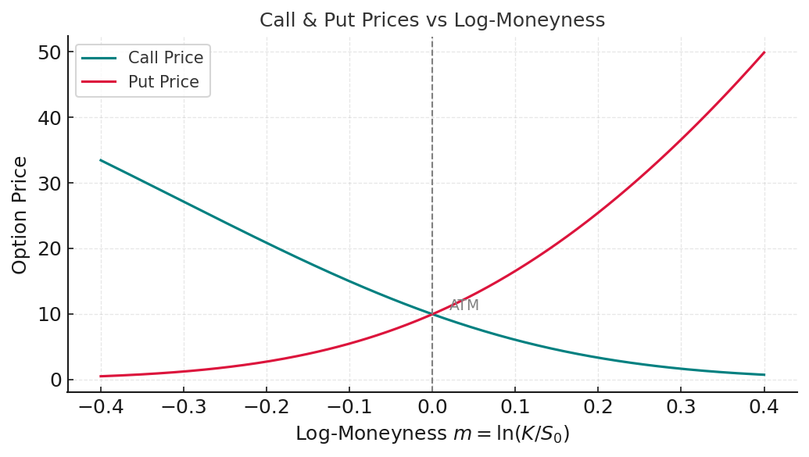
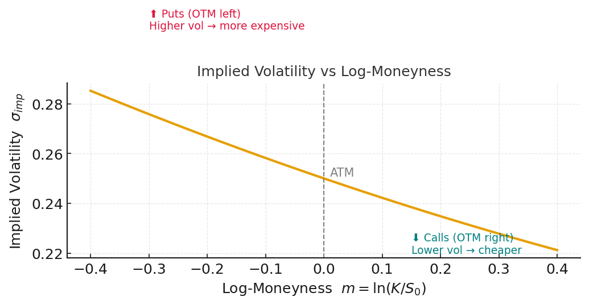
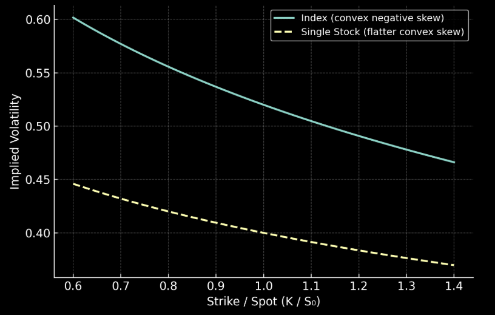

# 📈 Skew Smile in Finance

A **skew smile** (often just called "skew") refers to the pattern of **implied volatility** across different strikes of options for the same underlying and maturity.  
Instead of being flat (as predicted by the original Black–Scholes model), the implied volatility curve is typically **downward sloping** for equity markets — meaning puts (lower strikes) are more expensive (higher implied vol) than calls (higher strikes).

---

## 🔑 Key Concepts

### 1️⃣ Definition

Let:

$$
K = \text{strike}, \quad
T = \text{maturity}, \quad
\sigma_{\text{imp}}(K, T) = \text{implied volatility at strike } K.
$$

The **volatility skew** is the function:

$$
K \;\mapsto\; \sigma_{\text{imp}}(K, T)
$$

For equity indices:

- Typically **downward-sloping** (negative skew)
- Sometimes still called a "volatility smile" historically, even if not symmetric.

---

## ❓ Why Is There a Skew?

**Black–Scholes assumptions:**

- Log-returns are normally distributed  
- Volatility is constant  
- No jumps  

But real markets show:

- **Fat left tails:** Crashes are more frequent than Gaussian assumption  
- **Leverage effect:** Volatility rises when price drops  

Hence:

- Market makers demand higher premium for downside protection  
- Lower-strike puts get **higher implied vol** → negative skew

---

## 🧠 Interpreting "Puts Are More Expensive"

When we say:

> **"Puts (lower strikes) are more expensive than calls (higher strikes)"**

we mean that:

- **Market prices:** Deep OTM puts cost much more (per unit delta) than symmetric OTM calls  
- **Implied vol:** The volatility you must input in Black–Scholes to match market price is **higher** for puts than calls

---

### 🧮 Black–Scholes Formula for a European Put

$$
P_{\text{BS}}(S_0, K, T, r, q, \sigma)
= K e^{-rT} N(-d_2) - S_0 e^{-qT} N(-d_1)
$$

where:

$$
d_1 = \frac{\ln(S_0/K) + (r - q + 0.5\sigma^2)T}{\sigma \sqrt{T}},
\qquad
d_2 = d_1 - \sigma \sqrt{T}.
$$

---

### 📌 Definition of Implied Volatility

$$
P_{\text{BS}}(S_0,K,T,r,q,\sigma_{\text{imp}}) = P_{\text{mkt}}
$$

where $$P_{mkt}$$ is the observed market price.

---

### 📈 Vega and Implied Volatility Relationship

We know that the **vega** of a European put in Black–Scholes is:

$$
\frac{\partial P_{\text{BS}}}{\partial \sigma}
= S_0 e^{-qT} \phi(d_1) \sqrt{T} \; > 0
$$

where $$\phi(d_1)$$ is the standard normal probability density function.

Since $$\frac{\partial P_{BS}}{\partial \sigma} > 0 $$, the put price is a strictly increasing function of volatility.

Hence, if the observed market price is higher than the model price computed at ATM volatility:

$$
P_{\text{mkt}} > P_{\text{BS}}(\sigma_{\text{ATM}})
$$

the only way to match it is by using a higher volatility:

$$
P_{\text{BS}}(\sigma_{\text{imp}}) = P_{\text{mkt}}
\quad\Rightarrow\quad
\sigma_{\text{imp}} > \sigma_{\text{ATM}}
$$

This is exactly why a "more expensive" put implies a **higher implied volatility**.

Note:

### 🏷 Definition of $$\sigma_{ATM}$$

The **ATM implied volatility** is defined as the volatility that matches the market price of an at-the-money option (strike \(K = S_0\)):

$$
P_{\text{BS}}\bigl(S_0, K = S_0, T, r, q, \sigma_{\text{ATM}}\bigr)
= P_{\text{mkt}}^{\text{ATM}}
$$

This serves as the **reference volatility** for a given maturity \(T\).

---

When comparing a given put or call to the ATM level:

$$
\sigma_{\text{imp}} > \sigma_{\text{ATM}}
\quad\Rightarrow\quad
\text{Option is "rich" vs ATM (adds to negative skew)}
$$

$$
\sigma_{\text{imp}} < \sigma_{\text{ATM}}
\quad\Rightarrow\quad
\text{Option is "cheap" vs ATM (flattens skew)}
$$

---

### 🔢 Numerical Illustration

Suppose:

$$
S_0=100, \quad K=80, \quad T=1, \quad r=q=0
$$

Then:

$$
\sigma=20\% \;\Rightarrow\; P_{\text{BS}} \approx 5.40
$$

If:

$$
P_{\text{mkt}} = 6.00 \;\Rightarrow\; \sigma_{\text{imp}} \approx 24\%
$$

Hence: **higher price → higher implied vol → negative skew**

---

## 📊 Typical Shapes Across Assets

- **Equities/Indices:** Downward sloping (negative skew)  
- **FX:** Often U-shaped ("smile") due to symmetry of jumps  
- **Commodities:** Can have **positive skew** (calls more expensive) when supply shocks push prices up

---

## 📉 Risk-Neutral Density Link (Breeden–Litzenberger)

$$
\frac{\partial^2 C(K)}{\partial K^2} = e^{-rT} f(K)
$$

where $$f(K)$$ is the risk-neutral density at strike $$K$$.  
A steeper left skew → heavier left tail → higher crash probability under $$\mathbb{Q}$$.

---

## 🏦 Index vs. Single-Stock Skew

### 📈 Index Skew (More Negative)

- **Correlation effect:** During crises, correlations ↑ → severe index drops  
- **Portfolio hedging:** Institutions systematically buy index puts  
- **Outcome:** Puts are very expensive → skew steeper

### 🏢 Single-Stock Skew (Flatter)

- Idiosyncratic risk can be hedged by shorting the stock  
- Less systemic demand for puts  
- Outcome: skew is flatter, sometimes close to symmetric for liquid names

---

## 📏 Measuring Skew

### 25-Delta Risk Reversal

$$
RR_{25} = \sigma_{\text{call},25\Delta} - \sigma_{\text{put},25\Delta}
$$

Negative \(RR_{25}\) indicates negative skew (puts pricier).

### Slope per Log-Moneyness

$$
\text{Skew} = \frac{\partial \sigma_{\text{imp}}}{\partial \ln(K/S_0)}
$$

Steeper negative slope → steeper skew.

---

## 🛠 Practical Uses

- **Risk Management:** Skew steepness is a fear gauge  
- **Volatility Trading:** Trade skew via risk-reversals, flies  
- **Exotics Pricing:** Barriers, cliquets, autocalls are skew-sensitive

---

## 🔮 Skew Dynamics

- **Sell-offs:** Skew steepens as protection demand ↑  
- **Rallies:** Skew flattens as vol sellers step in  
- **Regimes:** Persistent in calm markets, spikes in crises

### 🏦 Comparing Skew: Single Stocks vs Indices

Equity indices almost always exhibit **steeper negative skew** than single names.  
This comes from **correlation effects** and **systematic hedging demand**.

---

#### 1️⃣ Skew Definition (Slope)

We can formalize skew as the slope of implied volatility vs. log-moneyness:

$$
\text{Skew}(T) = 
\frac{\partial \sigma_{\text{imp}}(K,T)}{\partial \ln(K/S_0)}
$$

A **more negative slope** means **puts are relatively more expensive**.

### 📐 Skew as Slope of Implied Volatility

We can formalize **skew** as the slope of implied volatility with respect to **log-moneyness**:

$$
\text{Skew}(T) =
\frac{\partial \sigma_{\text{imp}}(K,T)}{\partial \ln(K/S_0)}
$$

---

#### 🔎 Step 1 — Define Log-Moneyness

Log-moneyness is:

$$
m = \ln\!\bigl(K / S_0\bigr)
$$

- If $$m = 0$$: strike $$K = S_0$$ → **ATM option**  
- If $$m < 0$$: strike $$K < S_0$$ → **OTM put**  
- If $$m > 0$$: strike $$K > S_0$$ → **OTM call**

This puts calls and puts on the same x-axis, symmetrically around ATM.

This complements the skew plot perfectly:

- Left side (negative log-moneyness): put prices rise steeply as strikes go lower.

- Right side (positive log-moneyness): call prices decline and approach 0.

- Shows why puts dominate in pricing → implied vol is higher on the left wing.

This figure clearly shows:

- Left side (m < 0): Higher vol → puts more expensive

- Right side (m > 0): Lower vol → calls cheaper

- ATM: Dashed line at m = 0 as the reference point

---

#### 🔎 Step 2 — Sensitivity of Vol to Moneyness

The derivative

$$
\frac{\partial \sigma_{\text{imp}}}{\partial m}
$$

measures how implied vol changes as you move left/right on the smile:

- **If slope is negative:** vol increases when \(K\) decreases (left wing higher)  
- **If slope is positive:** vol increases when \(K\) increases (right wing higher)

---

#### 🔎 Step 3 — Interpretation for Equity Skew

In equity markets, we typically observe:

$$
\frac{\partial \sigma_{\text{imp}}}{\partial m} < 0
\quad \Rightarrow \quad
\text{Negative skew (downward sloping smile)}.
$$

Meaning:

- **Lower strikes:** $$m < 0 → \sigma_{imp}$$ **higher** → puts more expensive  
- **Higher strikes:** $$m > 0 → \sigma_{imp}$$ **lower** → calls cheaper

---

#### 📊 Economic Intuition

- Investors buy downside protection (puts), pushing up their price  
- Market makers require compensation for crash risk, steepening the left wing  
- As a result, the implied vol surface is **tilted downward** to the right

---

#### ✅ Key Takeaway

A **more negative slope** means:

$$
\text{Deep OTM puts carry higher implied vol}
\quad\Rightarrow\quad
\text{Crash risk is priced more expensively}.
$$

---

### 📊 Index Skew and the Correlation Effect

One of the main reasons **index skew is steeper** than single-stock skew is the **correlation effect**.

---

#### 1️⃣ Index Variance Formula

For an index defined as:

$$
I = \sum_{i=1}^{n} w_i S_i
$$

where $w_i$ are weights and $S_i$ are individual stock prices,  
the **variance of index returns** is:

$$
\text{Var}(I) =
\sum_{i=1}^{n} w_i^2 \sigma_i^2
+ 2 \sum_{i<j} w_i w_j \rho_{ij} \sigma_i \sigma_j
$$

with:

$$
\sigma_i = \text{volatility of stock i}, \qquad
\rho_{ij} = \text{correlation between stock i and j}.
$$

---

#### 2️⃣ Impact of Correlation on Index Volatility

When markets are calm:

$$
\rho_{ij} \approx 0.2 \; \text{to} \; 0.3
$$

During crises:

$$
\rho_{ij} \to 1
$$

:::info 
🔗 Why Correlations Tend to 1 During Crises

Empirically, during market stress, **pairwise correlations** between stocks tend to rise sharply:

$$
\rho_{ij} \;\to\; 1
$$

---

#### 1️⃣ Definition of Correlation

For two stocks $S_i$ and $S_j$, their correlation is:

$$
\rho_{ij} =
\frac{\text{Cov}(r_i, r_j)}
{\sigma_i \sigma_j}
$$

where $r_i, r_j$ are their returns and $\sigma_i, \sigma_j$ are volatilities.

---

#### 2️⃣ Common Risk Factor Dominance

Stock returns can be decomposed into **systematic** and **idiosyncratic** components:

$$
r_i = \beta_i F + \varepsilon_i
$$

where:

- $F$ = market factor (systematic risk)
- $\beta_i$ = sensitivity of stock $i$ to the factor
- $\varepsilon_i$ = idiosyncratic noise, uncorrelated across names

:::tip 📚 Side Note — Systematic vs. Idiosyncratic Risk
> This formula is based on **factor models** (CAPM-like decomposition (Capital Asset Pricing Model)):
>
>$$
>r_i = \alpha_i + \beta_i r_M + \epsilon_i
>$$
>
>where $r_M$ is the return of the market portfolio (systematic factor), $\beta_i$ is sensitivity to $r_M$ (sensitivity of asset 
i to market movements), and $\epsilon_i$ is idiosyncratic noise (shock) (uncorrelated with $r_M$).
>
>
> For simplicity we often set $$\alpha_i = 0$$​ when talking about risk decomposition:
>This leads to:
>
>$$
>\text{Cov}(r_i, r_j) \approx \beta_i \beta_j \text{Var}(r_M)
>$$
>
>and when $\text{Var}(r_M)$ surges, $\rho_{ij} \to 1$.
:::

:::info

Then the covariance between two stocks is:

$$
\text{Cov}(r_i, r_j)
= \beta_i \beta_j \text{Var}(F)
+ \underbrace{\text{Cov}(\varepsilon_i, \varepsilon_j)}_{\approx 0}
$$

During crises, **factor variance $\text{Var}(F)$ explodes**,  
and dominates idiosyncratic noise, so:

$$
\rho_{ij} \approx
\frac{\beta_i \beta_j \text{Var}(F)}
{\sqrt{\beta_i^2 \text{Var}(F) + \text{Var}(\varepsilon_i)}
\sqrt{\beta_j^2 \text{Var}(F) + \text{Var}(\varepsilon_j)}}
\to 1
$$

because $\text{Var}(F) \gg \text{Var}(\varepsilon_i)$ in stress periods.

---

#### 3️⃣ Intuition

- In calm markets: each stock's idiosyncratic drivers matter more → $\rho_{ij}$ modest  
- In stress markets: macro shocks dominate, everything moves together → $\rho_{ij}$ near 1  

This **correlation clustering** is why index volatility spikes during sell-offs.

---

#### ✅ Key Implication for Skew

Since index variance is:

$$
\text{Var}(I) =
\sum w_i^2 \sigma_i^2 +
2 \sum_{i<j} w_i w_j \rho_{ij} \sigma_i \sigma_j
$$

higher $\rho_{ij}$ magnifies the second term, causing index volatility and **index put prices to surge**, steepening the **index skew**.
:::

This causes **index variance to jump**:

$$
\text{Var}(I) \;\uparrow \quad \Rightarrow \quad
\sigma_{\text{Index}} = \sqrt{\text{Var}(I)} \;\uparrow
$$

Thus, the **probability of large downside moves increases**.

---

#### 3️⃣ Effect on Index Puts & Skew

Since option prices increase with volatility:

$$
\frac{\partial P_{\text{Index}}}{\partial \sigma_{\text{Index}}} > 0
$$

an increase in $\sigma_{\text{Index}}$ raises the value of puts,  
especially **deep OTM puts** (far left strikes):

$$
\sigma_{\text{imp}}^{\text{Index}}(K \downarrow) \;\uparrow
$$

This makes the **left wing of the vol smile higher** → steeper negative skew.

---

#### 4️⃣ Intuition

- **Single-stock crash:** affects only one name → correlation effect negligible  
- **Index crash:** usually involves simultaneous drawdowns across many constituents → rare but severe  
- **Market demand:** portfolio managers hedge with index puts, bidding them up and steepening skew

---

#### ✅ Key Insight

Index skew encodes the risk of **systemic moves**, i.e.  
the probability that all constituents fall together:

$$
|\text{Skew}_{\text{Index}}| > |\text{Skew}_{\text{Single}}|
$$

which is why **index puts trade richer** (higher implied vol) than single-name puts with the same moneyness.

#### 2️⃣ Index Skew: Correlation Effect

For an index $$I = \sum w_i S_i$$ with constituent stocks $$S_i$$,  
the variance of the index return is:

$$
\text{Var}(I) 
= \sum_i w_i^2 \sigma_i^2 
+ 2 \sum_{i<j} w_i w_j \rho_{ij} \sigma_i \sigma_j
$$

When market stress increases correlations $$\rho_{ij} \to 1 $$,  
the **index variance jumps**, making **index puts more valuable**:

$$
\sigma_{\text{imp}}^{\text{Index}}(K \downarrow) \;\uparrow
$$

Hence index skew becomes **steeper**.

---

#### 3️⃣ Single-Stock Skew: Idiosyncratic Risk

For a single stock \(S\), total variance is:

$$
\text{Var}(S) = \sigma_{\text{sys}}^2 + \sigma_{\text{id}}^2
$$

Idiosyncratic risk  $$\sigma_{id}$$ can be hedged by:

- Shorting the stock directly
- Reducing position size

This limits demand for deep OTM puts, so:

$$
|\text{Skew}_{\text{Single}}| < |\text{Skew}_{\text{Index}}|
$$

---

#### 4️⃣ Risk-Neutral Density Implications

By Breeden–Litzenberger:

$$
\frac{\partial^2 C(K)}{\partial K^2} = e^{-rT} f(K)
$$

Steeper index skew ⇒ **heavier left tail** in $$f(K)$$.  
Single stocks typically have **flatter tails** because idiosyncratic crashes are less correlated.

---

#### ✅ Key Takeaway

$$
|\text{Skew}_{\text{Index}}| > |\text{Skew}_{\text{Single}}|
\quad\Rightarrow\quad
\text{Index puts are relatively more expensive than single-stock puts}
$$

This is why index options are favored for portfolio protection,  
while single-stock skew is often used for **relative-value trading**.

---

## 📚 References

- Dupire (1994) — Local volatility surfaces  
- Rubinstein (1994) — Empirical smile  
- Gatheral (2006) — *The Volatility Surface*

---

## ✅ Key Takeaways

- **Higher put price = higher implied vol**
- Skew = market price of tail risk
- Index skew > single-stock skew due to correlation & systemic hedging
- Monitoring skew is critical for trading, hedging, risk mgmt

---

import TryIt from '@site/src/components/tryit/TryIt';

## 9. Practical Lab — Skew Smile (10 mini exercises)

<TryIt
  id="skew-smile-lab"
  chapterId="skew-smile"
  title="Skew & Smile — Mini Lab"
  intro="Complete each small function, then run the tests. Descriptions under each tile tell you exactly what to implement."
  starTotal={3}
  packWeight={0.3}
  packs={[
    {
      id: 'atm',
      name: '⭐ ATM volatility passthrough',
      question: 'Write atm_vol(sigma_atm) that just returns the ATM vol.',
      detect: "def\\s+atm_vol\\s*\\(",
      scaffold: `def atm_vol(sigma_atm):
    """Return the at-the-money volatility unchanged."""
    # TODO: return sigma_atm
    return 0
`,
      hint: `One-liner: return sigma_atm`,
      weight: 0.3,
      tests: [
        { expr: 'atm_vol(0.20)', expected: 0.20, tol: 1e-12 },
        { expr: 'atm_vol(0.18)', expected: 0.18, tol: 1e-12 },
      ],
    },

    {
      id: 'abs-moneyness-linear',
      name: '⭐ Linear smile vs |log-moneyness|',
      question: 'Implement smile_linear(sig_atm, a, m) = sig_atm + a*|m| where m = log(K/S0).',
      detect: "def\\s+smile_linear\\s*\\(",
      scaffold: `def smile_linear(sigma_atm, a, m):
    """Return sigma_atm + a*abs(m).  (m is log-moneyness)"""
    # TODO
    return 0.0
`,
      hint: `Use abs(m). Example: return sigma_atm + a*abs(m)`,
      weight: 0.3,
      tests: [
        // m = ln(0.8) in abs = 0.2231435513 → 0.2 + 0.05*0.2231435513
        { expr: 'smile_linear(0.20, 0.05, -0.2231435513)', expected: 0.211157177565, tol: 1e-9 },
        // m = ln(1.2) = 0.1823215568 → 0.2 + 0.05*0.1823215568
        { expr: 'smile_linear(0.20, 0.05, 0.1823215568)', expected: 0.20911607784, tol: 1e-9 },
      ],
    },

    {
      id: 'abs-moneyness-power',
      name: '⭐ Power smile vs |log-moneyness|^γ',
      question: 'Implement smile_power(sig_atm, a, gamma, m) = sig_atm + a*|m|**gamma.',
      detect: "def\\s+smile_power\\s*\\(",
      scaffold: `def smile_power(sigma_atm, a, gamma, m):
    """Return sigma_atm + a*abs(m)**gamma."""
    # TODO
    return 0.0
`,
      hint: `Use abs(m) ** gamma`,
      weight: 0.3,
      tests: [
        // m = ln(0.8) in abs = 0.2231435513
        { expr: 'smile_power(0.22, 0.10, 1.4, -0.2231435513)', expected: 0.2322466719543868, tol: 1e-9 },
        // m = ln(1.2) = 0.1823215568
        { expr: 'smile_power(0.22, 0.10, 1.4, 0.1823215568)', expected: 0.2292293949017666, tol: 1e-9 },
      ],
    },

    {
      id: 'skew-slope',
      name: '⭐ Skew as slope wrt log-moneyness',
      question: 'Implement skew_slope(imp_low, imp_high, m_low, m_high) = Δσ / Δm.',
      detect: "def\\s+skew_slope\\s*\\(",
      scaffold: `def skew_slope(imp_low, imp_high, m_low, m_high):
    """Return (imp_high - imp_low) / (m_high - m_low)."""
    # TODO
    return 0.0
`,
      hint: `Basic two-point slope formula.`,
      weight: 0.3,
      tests: [
        // (0.205 - 0.24) / (0.18 - (-0.22)) = -0.0875
        { expr: 'skew_slope(0.24, 0.205, -0.22, 0.18)', expected: -0.0875, tol: 1e-12 },
        // (0.20 - 0.26) / (0.20 - (-0.30)) = -0.12
        { expr: 'skew_slope(0.26, 0.20, -0.30, 0.20)', expected: -0.12, tol: 1e-12 },
      ],
    },

    {
      id: 'rr25',
      name: '⭐ 25Δ Risk Reversal',
      question: 'Implement rr25(call25, put25) = call25 − put25 (negative for equity skew).',
      detect: "def\\s+rr25\\s*\\(",
      scaffold: `def rr25(call25, put25):
    """Return call25 - put25."""
    # TODO
    return 0.0
`,
      hint: `Just subtract.`,
      weight: 0.3,
      tests: [
        { expr: 'rr25(0.19, 0.211)', expected: -0.021, tol: 1e-12 },
        { expr: 'rr25(0.175, 0.19)', expected: -0.015, tol: 1e-12 },
      ],
    },

    {
      id: 'bf25',
      name: '⭐ 25Δ Butterfly',
      question: 'Implement bf25(call25, put25, atm) = 0.5*(call25 + put25) − atm.',
      detect: "def\\s+bf25\\s*\\(",
      scaffold: `def bf25(call25, put25, atm):
    """Return 0.5*(call25 + put25) - atm."""
    # TODO
    return 0.0
`,
      hint: `Average wings, subtract ATM.`,
      weight: 0.3,
      tests: [
        // 0.5*(0.24+0.28) - 0.22 = 0.04
        { expr: 'bf25(0.24, 0.28, 0.22)', expected: 0.04, tol: 1e-12 },
        // 0.5*(0.18+0.22) - 0.17 = 0.03
        { expr: 'bf25(0.18, 0.22, 0.17)', expected: 0.03, tol: 1e-12 },
      ],
    },

    {
      id: 'linear-skew-model',
      name: '⭐ Linear skew model',
      question: 'Implement sigma_linear(sig_atm, b, m) = sig_atm + b*m (b < 0 for equity).',
      detect: "def\\s+sigma_linear\\s*\\(",
      scaffold: `def sigma_linear(sigma_atm, b, m):
    """Return sigma_atm + b*m."""
    # TODO
    return 0.0
`,
      hint: `Plain linear function of m.`,
      weight: 0.3,
      tests: [
        // sigma = 0.2 + (-0.1)*0.2 = 0.18
        { expr: 'sigma_linear(0.20, -0.10, 0.20)', expected: 0.18, tol: 1e-12 },
        // sigma = 0.2 + (-0.1)*(-0.2) = 0.22
        { expr: 'sigma_linear(0.20, -0.10, -0.20)', expected: 0.22, tol: 1e-12 },
      ],
    },

    {
      id: 'index-var',
      name: '⭐ Index variance with correlation',
      question: 'Implement index_var(w1,w2,s1,s2,rho) = w1²s1² + w2²s2² + 2w1w2ρs1s2.',
      detect: "def\\s+index_var\\s*\\(",
      scaffold: `def index_var(w1, w2, s1, s2, rho):
    """Return w1*w1*s1*s1 + w2*w2*s2*s2 + 2*w1*w2*rho*s1*s2."""
    # TODO
    return 0.0
`,
      hint: `Translate the formula literally.`,
      weight: 0.3,
      tests: [
        { expr: 'index_var(0.6, 0.4, 0.30, 0.25, 0.8)', expected: 0.1448, tol: 1e-12 },
        { expr: 'index_var(0.6, 0.4, 0.30, 0.25, 0.2)', expected: 0.0868, tol: 1e-12 },
      ],
    },

    {
      id: 'rich-vs-atm',
      name: '⭐ Rich vs ATM check (vega intuition)',
      question: 'Implement richer_than_atm(p_mkt, p_atm) that returns 1 if p_mkt>p_atm else 0.',
      detect: "def\\s+richer_than_atm\\s*\\(",
      scaffold: `def richer_than_atm(p_mkt, p_atm):
    """Return 1 if p_mkt > p_atm else 0."""
    # TODO
    return 0
`,
      hint: `Return 1 or 0, not True/False.`,
      weight: 0.3,
      tests: [
        { expr: 'richer_than_atm(6.00, 5.40)', expected: 1, tol: 0 },
        { expr: 'richer_than_atm(4.00, 4.50)', expected: 0, tol: 0 },
      ],
    },

    {
      id: 'symmetry-check',
      name: '⭐ Symmetry sanity (|m| invariant)',
      question: 'Implement symmetry_ok(m) that returns 1 if |m| == |-m| else 0.',
      detect: "def\\s+symmetry_ok\\s*\\(",
      scaffold: `def symmetry_ok(m):
    """Return 1 if abs(m) == abs(-m) else 0."""
    # TODO
    return 0
`,
      hint: `Use abs(m). Compare equality and return 1/0.`,
      weight: 0.3,
      tests: [
        { expr: 'symmetry_ok(-0.2231435513)', expected: 1, tol: 0 },
        { expr: 'symmetry_ok(0.2231435513)', expected: 1, tol: 0 },
      ],
    },
  ]}
/>
