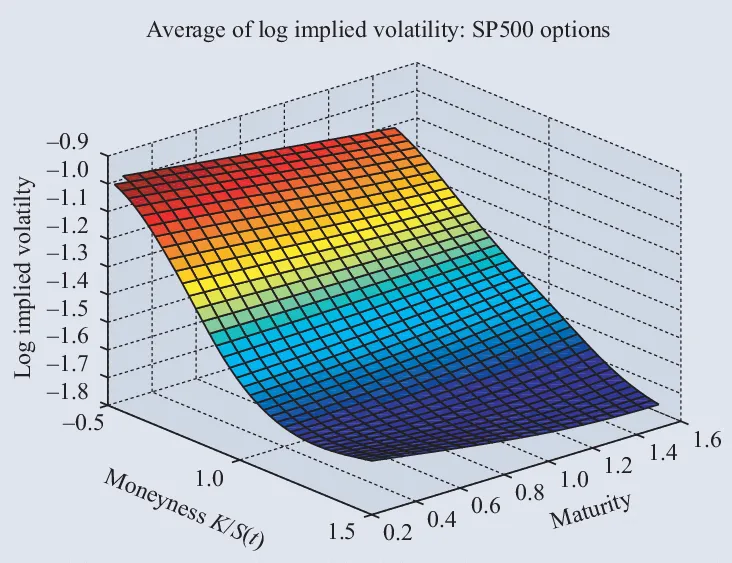
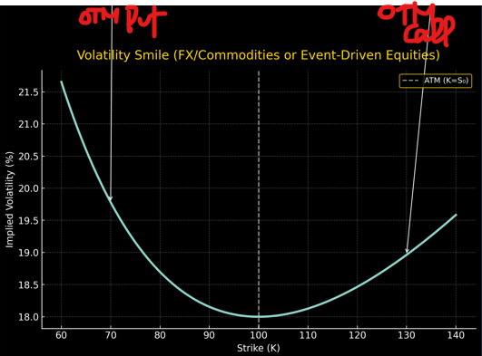
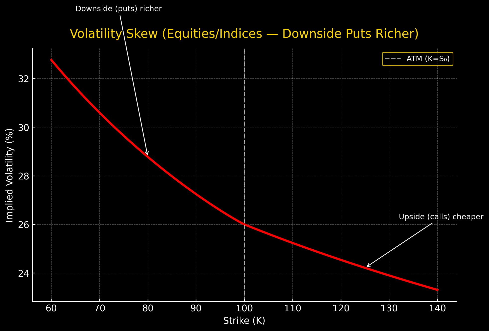

# 📚 Volatility Handbook

Welcome to the **Volatility Handbook** — a structured deep dive into all aspects of volatility in financial markets.  
This page is divided into **free sections** (fundamentals, intuition, practical concepts) and **premium advanced sections** (quantitative models, strategies, exotic products).

---

## 🟡 Part I — Free Content

---

<div className="index-box">
  <div className="index-title">Section Index — Volatility</div>
  <p className="index-sub">This is the overview. Each link points to the related chapter.</p>
  <ul>
    <li>
      <a href="#intro">Introduction to Volatility</a><br/>
      <strong>Historical Volatility (HV):</strong> Measured from past returns.
      <div style={{marginTop: '6px'}} />
      $$
      \sigma_{hist} = \sqrt{\frac{252}{N-1}\sum_{i=1}^N (r_i - \bar r)^2}
      $$
      <strong>Implied Volatility (IV):</strong> Backed out from option prices using Black–Scholes.<br/>
      <strong>Realized Volatility (RV):</strong> Annualized standard deviation of intraday realized returns.<br/>
      <em>Key point:</em> HV = backward-looking, IV = forward-looking, RV = ex-post realized.
    </li>

    <li><a href="#surfaces">Volatility Surfaces</a> — smile, skew, and term structure</li>
    <li><a href="#greeks">Volatility Greeks</a> — Vega, Vanna, Volga (intuition + math)</li>
    <li><a href="#products">Volatility Products</a> — variance swaps, vol swaps, VIX</li>
    <li><a href="#strategies">Volatility Strategies</a> — long/short vol, dispersion, skew trades</li>
    <li><a href="#dynamics">Dynamics of Volatility</a> — clustering, regimes, leverage effect</li>
    <li><a href="#risk-mgmt">Volatility in Risk Management</a> — hedging with skew/smile, vol-of-vol, VaR, stress testing, collars</li>
    <li><a href="#advanced">Advanced Topics</a> — stochastic/local vol, SABR, rough vol</li>
    <li><a href="#market-crisis">Volatility in Crises</a> — smile steepening, index skew vs. single stocks</li>
  </ul>
</div>

<div className="index-grid">
  <a className="index-tile" href="#surfaces">
    <h4>Volatility Surfaces</h4>
    <p>Smile, skew, term structure across strikes & maturities.</p>
  </a>
  <a className="index-tile" href="#greeks">
    <h4>Volatility Greeks</h4>
    <p>Vega, Vanna, Volga — sensitivity to volatility and skew.</p>
  </a>
  <a className="index-tile" href="#products">
    <h4>Volatility Products</h4>
    <p>Variance swaps, vol swaps, VIX futures, exotic vol trades.</p>
  </a>
  <a className="index-tile" href="#strategies">
    <h4>Volatility Strategies</h4>
    <p>Dispersion, skew arbitrage, long/short volatility trades.</p>
  </a>
  <a className="index-tile" href="#dynamics">
    <h4>Volatility Dynamics</h4>
    <p>Clustering, stochastic models, leverage effect, mean-reversion.</p>
  </a>
  <a className="index-tile" href="#risk-mgmt">
    <h4>Risk Management</h4>
    <p>Using skew and smile for hedging portfolios & exotics.</p>
  </a>
  <a className="index-tile" href="#advanced">
    <h4>Advanced Topics</h4>
    <p>SABR, rough volatility, forward variance, stochastic local vol.</p>
  </a>
  <a className="index-tile" href="#market-crisis">
    <h4>Volatility in Crises</h4>
    <p>Why skew steepens, correlation effect, vol-of-vol explosions.</p>
  </a>
</div>

---

### <span id="intro"/>1 - Introduction to Volatility

- **Historical Volatility (HV):** Measured from past returns.

$$
\sigma_{hist} = \sqrt{\frac{252}{N-1}\sum_{i=1}^N (r_i - \bar r)^2}
$$

- **Implied Volatility (IV):** Backed out from option prices using Black–Scholes.  
- **Realized Volatility (RV):** Annualized standard deviation of actual observed intraday returns.

**Key point:**  
HV is backward-looking, IV is forward-looking, RV is ex-post realized.


---

### <span id="surfaces"/>2 - Volatility Surfaces

A **volatility surface** is the 3D object that shows how implied volatility varies with:

- **Strike (K)** → captures skew/smile  
- **Maturity (T)** → captures term structure  
- **Spot (S₀)** → indirectly affects skew dynamics  

In Black–Scholes, volatility is constant. In real markets, the surface encodes **risk-neutral expectations** of future distributions.





# Volatility Smile — Using Black–Scholes and Brentq

This section shows how we can build a **synthetic volatility smile** using the **Black–Scholes model** and recover implied volatilities with the **Brentq root-finding algorithm**.

---

# Black–Scholes Option Pricing

For a European **call option**, the Black–Scholes price is:

$$
C(S_0, K, T, r, \sigma) =
S_0 \, N(d_1) - K e^{-rT} N(d_2)
$$

For a **put option**:

$$
P(S_0, K, T, r, \sigma) =
K e^{-rT} N(-d_2) - S_0 N(-d_1)
$$

where:

$$
d_1 = \frac{\ln(S_0/K) + (r + \tfrac{1}{2}\sigma^2)T}{\sigma \sqrt{T}},
\quad
d_2 = d_1 - \sigma \sqrt{T}.
$$

- $$ S_0 $$: Current stock price  
- $$ K $$: Strike price  
- $$ T $$: Time to maturity (in years)  
- $$ r $$: Risk-free rate  
- $$ \sigma $$: Volatility  
- $$ N(\cdot) $$: CDF of the standard normal distribution  

---

# Implied Volatility and Root-Finding

- The **market gives us the option price**, but not the volatility.  
- We solve for **implied volatility** $$ \sigma_{imp} $$ by finding the root of:

$$
f(\sigma) = C_{BS}(S_0, K, T, r, \sigma) - C_{mkt}.
$$

- If $$ f(\sigma) = 0 $$, then $$ \sigma $$ is the implied volatility.

---

## ⚙️ Why Brentq?

The **Brentq method** is a root-finding algorithm that combines:
- **Bisection method** (guarantees convergence if the root is bracketed),
- **Secant method** (fast convergence using linear approximation),
- **Inverse quadratic interpolation** (accelerates convergence when smoothness allows).

**Key advantages for implied vol:**
- Always converges if you give it a bracket $$[a,b]$$ such that $$f(a)\cdot f(b) < 0$$.  
- More stable than **Newton–Raphson**, which may diverge if the initial guess is poor or Vega ≈ 0.  
- Faster than pure bisection.

That’s why financial libraries (like **QuantLib**) often rely on Brentq or similar **hybrid algorithms**.

---

# Python Implementation

```python
from scipy.optimize import brentq

def implied_vol(S, K, T, r, market_price, option="call"):
    f = lambda sigma: bs_price(S, K, T, r, sigma, option) - market_price
    return brentq(f, 1e-6, 5.0)  # 0.01% to 500% volatility search

We use **Brentq** (a robust root-finding algorithm) to solve this:

```

# ⚙️ Brent’s Method (Brentq) for Implied Volatility

When we solve for **implied volatility**, we need to find the root of:

$$
f(\sigma) = C_{BS}(S_0, K, T, r, \sigma) - C_{mkt} = 0
$$

where $$ C_{BS} $$ is the Black–Scholes price and $$ C_{mkt} $$ is the observed market price.  
Since no closed form exists for $$ \sigma_{imp} $$, we use **root-finding**.

---

# 🔑 1. The Bracketing Condition

We start with an interval $$[a,b]$$ such that:

$$
f(a) \cdot f(b) < 0
$$

which guarantees, by the **Intermediate Value Theorem**, that a root lies in $$[a,b]$$.

In implied volatility problems:
- $$ a = 10^{-6} $$ (≈ 0% volatility)  
- $$ b = 5 $$ (≈ 500% volatility)  

---

# 🔑 2. Methods Combined in Brentq

Brent’s algorithm is a **hybrid** combining:

1. **Bisection method** (safe, linear convergence):  
   Update midpoint:
   $$
   m = \frac{a+b}{2}
   $$
   Replace the endpoint with same sign as $$f(m)$$.

2. **Secant method** (faster, uses linear interpolation):  
   Approximate root as:
   $$
   \sigma_{n+1} = b - f(b)\frac{b-a}{f(b)-f(a)}.
   $$

3. **Inverse quadratic interpolation (IQI)** (fastest, uses parabola):  
   If we have 3 distinct points $$(x_0,f_0), (x_1,f_1), (x_2,f_2)$$, then:
   $$
   \sigma_{n+1} = \frac{f_1 f_2}{(f_0-f_1)(f_0-f_2)}x_0
   + \frac{f_0 f_2}{(f_1-f_0)(f_1-f_2)}x_1
   + \frac{f_0 f_1}{(f_2-f_0)(f_2-f_1)}x_2.
   $$

---

# 🔑 3. Brent’s Decision Rule (Extended)

At each iteration, Brent’s method decides *which step is safest and most efficient*:

1. **Inverse Quadratic Interpolation (IQI):**  
   If the last three points are distinct and the interpolation yields a root inside the bracket $$[a,b]$$, then use IQI.  
   - Formula:  
     $$
     \sigma_{n+1} = 
     \frac{f_1 f_2}{(f_0-f_1)(f_0-f_2)}x_0
     + \frac{f_0 f_2}{(f_1-f_0)(f_1-f_2)}x_1
     + \frac{f_0 f_1}{(f_2-f_0)(f_2-f_1)}x_2
     $$
   - Intuition: Fit a quadratic curve through the last 3 known points and take its zero.

2. **Secant Step:**  
   If IQI is not stable (e.g., denominator close to zero, or root falls outside bracket), fall back to the secant method:  
   - Formula:  
     $$
     \sigma_{n+1} = b - f(b)\frac{b-a}{f(b)-f(a)}
     $$
   - Intuition: Approximate the root as the intersection of the line through the last two points with the x-axis.

3. **Bisection Step:**  
   If even the secant step looks unreliable (root not inside bracket, or step too small), then use bisection:  
   - Formula:  
     $$
     \sigma_{n+1} = \frac{a+b}{2}
     $$
   - Intuition: Always safe, since it halves the interval and guarantees progress.

👉 **Key insight:** Brent’s method is adaptive — it always prefers the fastest step available, but falls back to a safe step if necessary. That’s why it converges quickly but never diverges.

---

# 🔑 4. Convergence Properties (Extended)

Brent’s method inherits the best of all worlds:

1. **Bisection (Safe but Slow):**  
   Linear convergence.  
   - Error bound halves each step:  
     $$
     |x_{n+1} - r| \leq \tfrac{1}{2} |x_n - r|
     $$

2. **Secant Method (Faster):**  
   Superlinear convergence (order ≈ 1.618, the golden ratio).  
   - Error bound:  
     $$
     |x_{n+1} - r| \leq C |x_n - r|^{1.618}
     $$

3. **Inverse Quadratic Interpolation (Fastest):**  
   Convergence of order ≈ 1.84.  
   - Error shrinks faster than secant but slower than Newton’s quadratic rate.

4. **Brent’s Hybrid Guarantee:**  
   - If IQI and secant steps are valid, Brent achieves **superlinear convergence** close to Newton.  
   - If they fail, bisection ensures convergence is still guaranteed.  
   - In practice:  
     - Converges in ≤ 5–7 iterations for implied volatility.  
     - More robust than Newton–Raphson (which can fail if Vega ≈ 0).


## 🔍 Summary Formula

The Brentq iteration is essentially:

$$
\sigma_{n+1} =
\begin{cases}
IQI(a,b,c), & if stable \\
Secant(a,b), & else if better than bisect \\
\frac{a+b}{2}, & (fallback bisection).
\end{cases}
$$

where $$(a,b,c)$$ are the last 2 or 3 bracketed points.

---

#  Why Use Brentq for Implied Vol?

- Vega (the derivative of option price wrt vol) can be close to zero → Newton–Raphson fails.  
- Brentq guarantees convergence if the root is bracketed.  
- Financial libraries (QuantLib, SciPy, etc.) use it for implied volatility.

---

## 📌 Takeaway

- Brentq is **root-finding by safety net**.  
- Always converges, but fast when possible.  
- That’s why it’s the **industry standard** for implied volatility extraction.

---

#### 1️⃣ Smile vs Skew

- **Smile (FX, commodities):** Both deep OTM puts and OTM calls have higher vol → U-shaped curve.  
- **Skew (equities, indices):** Downward slope — puts more expensive than calls.  
- **Mixed:** In some assets, the surface has *smirked* asymmetry.

Formally:

$$
\sigma_{imp}(K,T) \quad with slope:  
\frac{\partial \sigma_{imp}}{\partial \ln(K/S_0)}
$$

- Negative slope → **equity skew** (downside puts expensive).  
- Symmetric → **FX smile**.  





---

## 🧭 Volatility Smile vs Skew Across Asset Classes

Volatility behavior differs **across asset classes**.  
Below is a comparative summary showing how **FX, commodities, equities, and indices** exhibit different shapes of implied volatility surfaces.

---

<div className="lux-table">

| **Asset Class** | **Shape** | **Mathematical Form** | **Economic Intuition** | **Notes / Examples** |
|:----------------|:-----------|:----------------------|:-----------------------|:----------------------|
| **FX (Foreign Exchange)** | **Symmetric Smile (U-Shape)** | $$ \sigma_{imp}(K,T) = \sigma_{ATM} + a \Big(\frac{K}{S_0} - 1\Big)^2, \quad a > 0 $$ | Exchange rates can move **both up or down** sharply (no natural drift or bias).<br/>Tail risk is **two-sided** due to macro shocks. | Both **OTM puts and OTM calls** expensive.<br/>E.g., EUR/USD, USD/JPY. |
| **Commodities** | **Symmetric Smile (U-Shape)** | See formula below | **Supply shocks** … | Crude oil, … |
| **Single Equities** | **Mildly Negative Skew** | $$ \frac{\partial \sigma_{imp}}{\partial \ln(K/S_0)} < 0 $$ | Stocks can **crash fast** but rise slowly.<br/>Investors hedge downside → puts expensive. | “Smirk” shape rather than pure smile. |
| **Equity Indices** | **Strong Negative Skew** | $$ \sigma_{imp}(K,T) = \sigma_{ATM} + b \ln\!\Big(\frac{K}{S_0}\Big), \quad b < 0 $$ | During crises, **correlations ↑**, all stocks drop together → index puts surge in demand.<br/>Reflects **systemic risk premium**. | S&P 500, Euro Stoxx 50 — pronounced skew. |

</div>

Commodities:
$$
\sigma_{imp}(K,T) = \sigma_{ATM} + a \left| \frac{K}{S_0} - 1 \right|^{\gamma},
\quad \gamma \approx 1.5 .
$$

---

### Why the Difference?

| **Driver** | **FX / Commodities** | **Equities / Indices** |
|:------------|:--------------------|:-----------------------|
| **Tail Risk Symmetry** | Two-sided (up & down) | Mostly downside-driven |
| **Investor Behavior** | Speculative & hedging both ways | Put buying for crash protection |
| **Correlation Dynamics** | Limited systemic correlation | Correlation spikes during crashes |
| **Distribution Shape** | Fat tails on both sides | Negatively skewed returns |

---

### 💬 Summary

- **FX & Commodities → “Smile”**  
  → Volatility increases symmetrically as you move away from ATM (both tails risky).  

- **Equities & Indices → “Skew”**  
  → Downside tail dominates; volatility higher for **OTM puts** (left skew).  

Formally, the **skew** is quantified as:

$$
Skew(T) = 
\frac{\partial \sigma_{imp}(K,T)}{\partial \ln(K/S_0)}
$$

- If **Skew < 0**, the smile slopes downward → equity-style market.  
- If **Skew ≈ 0** but curvature positive, you have an FX- or commodity-type **smile**.  

---

<div className="note-box">
💡 *Rule of Thumb:*  
Markets where price changes are **directionally uncertain** → smile.  
Markets where downside shocks dominate → skew.
</div>


### 1️⃣ Smile vs Skew (Extended)

In implied volatility surfaces, two typical shapes are observed: **smiles** and **skews (smirks)**.  

- **Volatility Smile (common in FX & commodities, sometimes equities):**  
  Both deep in-the-money (ITM) puts and out-of-the-money (OTM) calls show **higher implied volatility** than at-the-money (ATM).  
  → The graph looks like a **U-shape**.  

  **Intuition:**  
  - In **FX markets**, the distribution of returns is often closer to symmetric, since there is no natural "equity crash" bias — both extreme depreciation and appreciation of a currency are possible.  
  - In **commodities**, storage costs, convenience yields, and supply shocks can generate large moves on either side, producing symmetric risk.  
  - In **equities**, smiles can appear in short-dated options around earnings announcements, where both upside and downside jumps are plausible.  

- **Volatility Skew / Smirk (equities & indices):**  
  Equity index options usually show a **downward-sloping curve**:  
  - OTM puts have much higher implied vol than OTM calls.  
  - This is called the **equity skew** or **volatility smirk**.  

  **Intuition:**  
  - Investors demand insurance against crashes → OTM puts are expensive.  
  - Equity returns are negatively skewed (big downside moves more likely than extreme upside moves).  

- **Mixed Shapes:**  
  Some assets (emerging market FX, single-stock options with takeover risk, crypto) display **asymmetric smiles**:  
  - Skewed to one side, called a **smirk**.  
  - Example: Crypto options sometimes show higher OTM call vols due to demand for upside speculation.

---

**Mathematical representation:**

We denote implied volatility as a function of strike and maturity:

$$
\sigma_{imp}(K,T)
$$

The **slope with respect to log-moneyness** is:

$$
\frac{\partial \sigma_{imp}}{\partial \ln(K/S_0)}
$$

- **Negative slope** → equity-style skew (downside puts more expensive).  
- **Symmetric U-shape** → volatility smile.  

---

✅ **Answer to your question:**  
Yes — a **smile can appear in equities too**, especially in **short-dated options around earnings** or in **very illiquid/small-cap names**, where large moves are equally likely in both directions.  

But the **default, long-term shape for equity indices** is a **skew (smirk)**, due to crash risk and risk premia.  

---


---

#### 2️⃣ Term Structure

Implied volatility depends on time-to-maturity $T$:

- **Equities:** Short-term vols often higher due to event risk (earnings, Fed meetings).  
- **Rates/FX:** Can be upward or downward sloping depending on macro environment.  

We define forward implied variance:

$$
v(T_1,T_2) = \frac{T_2 \, \sigma^2(T_2) - T_1 \, \sigma^2(T_1)}{T_2 - T_1}
$$

which ensures internal consistency of the surface.

---

#### 3️⃣ No-Arbitrage Constraints

The surface must respect arbitrage-free conditions:

1. **Calendar arbitrage (in $T$):** Implied variance must be non-decreasing in $T$.  
   $$
   \frac{\partial (T\sigma^2(K,T))}{\partial T} \geq 0
   $$
2. **Butterfly arbitrage (in $K$):** Risk-neutral density must be positive:  
   $$
   \frac{\partial^2 C(K,T)}{\partial K^2} \geq 0
   $$
3. **Vertical spread bounds:** Option prices must be monotonic in strike.

These ensure the surface corresponds to a valid probability distribution.

---

#### 4️⃣ Local vs Stochastic Volatility

- **Local Volatility:** $\sigma_{loc}(S,t)$ deterministic function calibrated to fit the surface. (Dupire’s equation).
  
  $$
  \sigma_{loc}^2(K,T) = 
  \frac{\frac{\partial C}{\partial T}}
  { \tfrac{1}{2} K^2 \frac{\partial^2 C}{\partial K^2} }
  $$
  
- **Stochastic Volatility:** $\sigma_t$ follows a diffusion (e.g. Heston, SABR).  
  Captures **vol-of-vol** and skew dynamics better.

---

#### 5️⃣ Practical Example

Suppose $S_0 = 100$, $T=1y$:

| Strike | Market IV | Type of Shape |
|-------:|-----------|---------------|
| 80     | 35%       | Put expensive (left wing high) |
| 100    | 25%       | ATM benchmark |
| 120    | 20%       | Call cheap (right wing low) |

- This is a **negative skew** typical of equity indices.  
- If both wings were high → we’d see a **smile**.

---

✅ **Takeaway:**  
The volatility surface is the **DNA of options markets**. It encodes all expectations of tail risk, skew, and mean reversion, and is the foundation for exotic pricing.

---


---

## 💎 Part II — Premium Content

:::info Premium Section
🚀 The sections below are part of the **advanced Volatility Handbook**.  
👉 [Get the full version here](https://gumroad.com/yourproduct)
:::

<div className="index-box">
  <div className="index-title">Section Index — Premium Content</div>
  <p className="index-sub">This is the master overview.</p>
  <ul>
    <li>
      <a href="#modelsofvol">Mathematical Models of Volatility (Premium)</a><br/>
      <strong>ARCH/GARCH models:</strong> Capture clustering of volatility.<br/>
      <strong>Heston model:</strong>
      <div style={{marginTop: '6px'}} />
      $$
      dS_t = \mu S_t \, dt + \sqrt{v_t}\, S_t \, dW_t^S \\
      dv_t = \kappa(\theta - v_t)\, dt + \xi \sqrt{v_t}\, dW_t^v
      $$
      <strong>SABR model:</strong> Popular in rates & FX.<br/>
      👉 Calibration methods and pitfalls.
    </li>

    <li>
      <a href="#convexity-premium">Convexity and Nonlinear Effects (Premium)</a><br/>
      Convexity adjustment in volatility products; smile dynamics (sticky delta vs sticky strike); skew risk premium.
    </li>

    <li>
      <a href="#vol-strats-premium">Volatility Trading Strategies (Premium)</a><br/>
      Long vol vs short vol; dispersion trades (index vs constituents); vol arbitrage.
    </li>

    <li>
      <a href="#exotics-premium">Exotic Derivatives and Volatility (Premium)</a><br/>
      Barrier options sensitivity to skew; autocallables and vol-of-vol impact; structured products & vol.
    </li>

    <li>
      <a href="#quant-research-premium">Quantitative Research on Volatility (Premium)</a><br/>
      Extracting risk-neutral density; implied skewness & kurtosis; entropy-based methods.
    </li>
  </ul>
</div>

---

## ✅ Key Takeaways

- Volatility is not just a number — it’s a **surface** across strikes and maturities.  
- Market-quoted IV encodes forward-looking expectations under the risk-neutral measure.  
- Greeks like **Vega, Vanna, Volga** are essential for managing exposure to vol.  
- Advanced models (Heston, SABR, GARCH) are needed to capture dynamics beyond Black–Scholes.  
- Trading & risk management rely heavily on volatility pricing.

---
